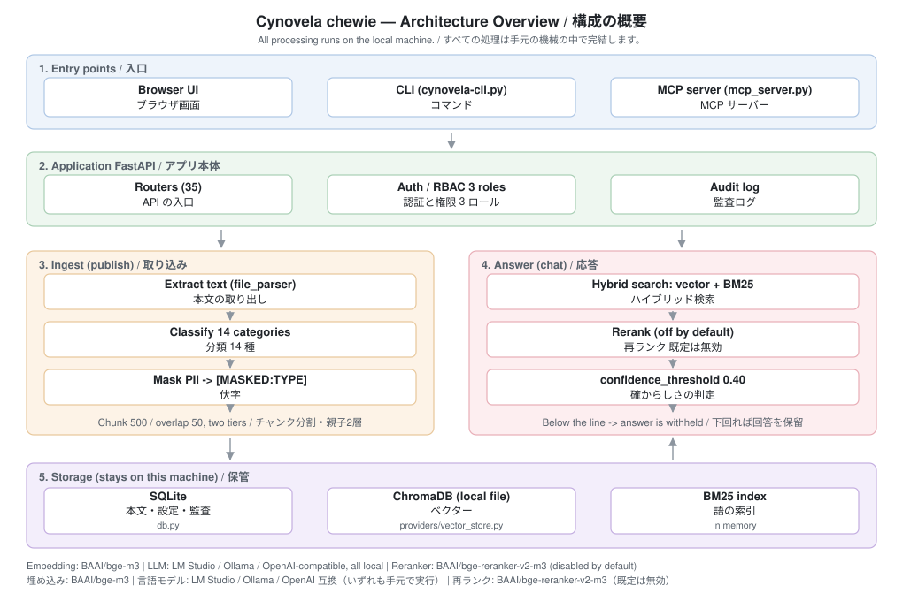

# Cynovela アーキテクチャ

**日本語版はこちら → [日本語](#日本語)**

## English

> **About this document**
> Cynovela is a completely unofficial learning tool built by an individual to
> understand the concepts of AI platform tools hands-on. It is not a commercial
> product nor an official implementation.
> The implementation is entirely original, built on an OSS stack of
> FastAPI / SQLite / ChromaDB / BGE-M3 / a local LLM.
> It does not represent the official position of any company or product.

This document is for the reader who wants to know how Cynovela works inside. It
covers the overall shape, the features that are confirmed as implemented, how
ingest and classification work, how search works, how to read the scores, the
shape of an answer, and the main categories of the API.

---

**Contents**

- [1. Overview](#1-overview)
  - [1.1 Component Overview Diagram](#11-component-overview-diagram)
  - [1.2 Role of Each Layer](#12-role-of-each-layer)
  - [1.3 Workspace and Collection](#13-workspace-and-collection)
  - [1.4 Component Changes by Startup Mode](#14-component-changes-by-startup-mode)
- [2. List of Confirmed Implemented Features](#2-list-of-confirmed-implemented-features)
  - [2.1 RAG (Retrieval-Augmented Generation) Pipeline](#21-rag-retrieval-augmented-generation-pipeline)
  - [2.2 Guardrails / Security](#22-guardrails--security)
  - [2.3 Smart Ingestion (Ingest and Classification)](#23-smart-ingestion-ingest-and-classification)
  - [2.4 Surrounding Features](#24-surrounding-features)
- [3. How Ingest and Classification Work (Smart Ingestion)](#3-how-ingest-and-classification-work-smart-ingestion)
  - [3.1 The Concept of Smart Ingestion](#31-the-concept-of-smart-ingestion)
  - [3.2 The 14 Category Definitions (All of Them)](#32-the-14-category-definitions-all-of-them)
  - [3.3 The 3-Stage Classification Engine](#33-the-3-stage-classification-engine)
  - [3.4 Hash Based Differential Sync (DataSyncService)](#34-hash-based-differential-sync-datasyncservice)
  - [3.5 Ingest Without Masking (raw_only) and the Old Raw Mode](#35-ingest-without-masking-raw_only-and-the-old-raw-mode)
  - [3.6 Chunk Splitting Strategy](#36-chunk-splitting-strategy)
  - [3.7 Compatibility With the Old Classification](#37-compatibility-with-the-old-classification)
- [4. How Search Works (the RAG Pipeline)](#4-how-search-works-the-rag-pipeline)
  - [4.1 Pipeline Flow](#41-pipeline-flow)
  - [4.2 Hybrid Search (Vector + BM25)](#42-hybrid-search-vector--bm25)
  - [4.3 The Role of the Reranker](#43-the-role-of-the-reranker)
  - [4.4 Advanced Search Options (Advanced RAG)](#44-advanced-search-options-advanced-rag)
  - [4.5 The Parameters of the `rag` Section](#45-the-parameters-of-the-rag-section)
- [5. How to Read the Scores](#5-how-to-read-the-scores)
  - [5.1 The 3 Kinds of Score](#51-the-3-kinds-of-score)
  - [5.2 What Each Score Means](#52-what-each-score-means)
  - [5.3 Confidence Threshold (confidence_threshold)](#53-confidence-threshold-confidence_threshold)
- [6. The Shape of an Answer](#6-the-shape-of-an-answer)
  - [6.1 Strictness Modes (2 Kinds)](#61-strictness-modes-2-kinds)
  - [6.2 Answer Style by Role](#62-answer-style-by-role)
  - [6.3 RAG Presets (5 in Total)](#63-rag-presets-5-in-total)
  - [6.4 The 3 RAG Modes](#64-the-3-rag-modes)
  - [6.5 Answer Format](#65-answer-format)
- [7. Main Categories of API Endpoints](#7-main-categories-of-api-endpoints)

## 1. Overview

### 1.1 Component Overview Diagram



```
            +-----------------------------------------------------+
            |                Frontend (frontend/)                 |
            |  Pages / Workspace UI / Chat UI / Dashboard         |
            +-----------------------------------------------------+
                                  |  HTTP / SSE (Server-Sent Events)
                                  v
+-----------------------------------------------------------------------+
|                       FastAPI app (server.py)                         |
|                                                                       |
|  +----------------+   +----------------+   +----------------------+   |
|  | IP allowlist   |   | Auth middleware|   | RBAC helpers         |   |
|  | (lan/tailscale)|   | (Bearer Token) |   | core/auth.py         |   |
|  +----------------+   +----------------+   +----------------------+   |
|                                                                       |
|  +-----------------------------------------------------------------+  |
|  |  Router layer (routers/), 36 routers                            |  |
|  |  workspaces / collections / sources / chat / settings /         |  |
|  |  guardrails / policies / mcp / dashboard / files / users ...    |  |
|  +-----------------------------------------------------------------+  |
|                                                                       |
|  +-----------------------------------------------------------------+  |
|  |  Service / domain layer                                         |  |
|  |  rag.py            : RAG pipeline core                          |  |
|  |  guardrail.py      : PII masking / guardrails                   |  |
|  |  chunker.py        : Contextual Chunking                        |  |
|  |  adaptive_rag.py   : complexity scoring / Agentic loop          |  |
|  |  services/data_sync.py : hash-based differential sync           |  |
|  |  vault_enc.py      : Fernet encryption interface (enc:)         |  |
|  +-----------------------------------------------------------------+  |
|                                                                       |
|  +-----------------------------------------------------------------+  |
|  |  Provider abstraction (providers/)                              |  |
|  |  llm_adapter.py (LMStudioAdapter / MockAdapter)                 |  |
|  |  embedding.py (BGE-M3 / MiniLM / TF-IDF / MLX skeleton)         |  |
|  |  reranker.py  (NoReranker / CrossEncoder / FlashRank /          |  |
|  |                Ollama / MLX skeleton)                           |  |
|  |  classifier.py (RuleBased / API)                                |  |
|  |  vector_store.py (Chroma impl. / Qdrant skeleton)               |  |
|  +-----------------------------------------------------------------+  |
+-----------------------------------------------------------------------+
        |                            |                       |
        v                            v                       v
+----------------+         +-------------------+    +-------------------+
| SQLite DB      |         | ChromaDB          |    | LM Studio (LLM)   |
| ~/.cynovela/   |         | ~/.cynovela/      |    | (HTTP /v1)        |
| db/*.db        |         | vector/*/chroma   |    | or mock           |
| 38 tables      |         | __raw / __masked  |    |                   |
+----------------+         +-------------------+    +-------------------+
```

External connections are also provided through an MCP (Model Context Protocol: a standard for connecting external tools to an LLM) server; `mcp_server.py` receives JSON-RPC and calls the FastAPI endpoints.

### 1.2 Role of Each Layer

#### 1.2.1 Frontend Layer

A static UI whose entry point is `frontend/index.html`. It has screens such as the workspace list, collection details, chat, and dashboard, and FastAPI serves them from the same origin. Some areas are hidden with `display:none` until JavaScript initialization finishes, and after initialization the display switches according to the role and settings.

#### 1.2.2 Middleware Layer (IP Allowlist / Authentication)

- **IP allowlist**: Works only when you pass `--allow-tailscale` (detected via `tailscale ip -4`) or `--allow-subnet` (any CIDR). **If you do not pass them, everything passes through.** When an allowlist is configured, HTTP 403 is returned to IPs that are not allowed. The default bind address is `0.0.0.0`; use `--local-only` to narrow it.
- **Authentication**: Received in the form `Authorization: Bearer<token>`, and user information is resolved by `get_user_from_token()` in `core/auth.py`. The only accepted authentication is the JWT issued by `POST /api/auth/login` (the same applies when starting with `--demo`). The former `Bearer demo-token-{user_id}` has been removed and is not accepted.

#### 1.2.3 Router Layer (routers/)

36 routers handle the API endpoints. Role checks are consolidated into the 4 helpers `_require_admin`, `_require_authenticated`, `_require_role`, and `_require_admin_or_self`, used in 242 places in total.

#### 1.2.4 Service / Domain Layer

The RAG pipeline core is consolidated in `rag.py` (44 functions); PII masking is handled by `guardrail.py`, contextual chunking by `chunker.py`, and complexity scoring plus the Agentic loop by `adaptive_rag.py`. Fernet encryption is provided as a thin wrapper by `vault_enc.py`, which encrypts only the body text of the raw tier.

#### 1.2.5 Provider Abstraction (providers/)

The LLM, embedding, reranker, classifier, and vector store are held as replaceable abstractions. Fully implemented ones (LM Studio / BGE-M3 / Chroma / NoReranker / CrossEncoder / FlashRank / Ollama Reranker / RuleBased Classifier) and skeleton-only ones that raise `NotImplementedError` (MLX Embedding / MLX Reranker / Qdrant VectorStore / GraphRAG Strategy) coexist.

#### 1.2.6 Storage Layer

- **SQLite**: Default `~/.cynovela/db/cynovela.db` (`~/.cynovela/db/demo.db` in demo mode). It can be overridden with the `CYNOVELA_DB` environment variable.
- **ChromaDB**: Default `~/.cynovela/vector/default/chroma`. It can be overridden with the `CYNOVELA_CHROMA` environment variable. For each collection ID it is split into two: `{cid}__raw` and `{cid}__masked`.

### 1.3 Workspace and Collection

Cynovela isolates data in two layers: the "workspace" (the unit that groups users and guardrail policies) and the "collection" (the unit that holds the actual set of files and the search strategy).

#### 1.3.1 Workspace

A workspace is "a management unit that bundles users, a guardrail policy, and multiple collections".

```sql
CREATE TABLE IF NOT EXISTS workspaces (
    id TEXT PRIMARY KEY,
    name TEXT NOT NULL UNIQUE,
    guardrail_policy_id TEXT REFERENCES guardrail_policies(id),
    created_at TEXT DEFAULT (datetime('now'))
);
```

Intermediate tables:

| Table | Purpose |
|---|---|
| `workspace_sources` | Association between a workspace and a source |
| `workspace_policies` | Association between a workspace and a guardrail policy |
| `workspace_users` | Association between a workspace and a user |

#### 1.3.2 Collection

A collection is "a unit of a file group together with its chunk strategy and access control".

```sql
CREATE TABLE IF NOT EXISTS collections (
    id TEXT PRIMARY KEY,
    name TEXT NOT NULL,
    workspace_id TEXT NOT NULL REFERENCES workspaces(id) ON DELETE CASCADE,
    status TEXT DEFAULT 'draft' CHECK(status IN ('draft','ingested','publishing','ready','failed')),
    access_level TEXT DEFAULT 'public' CHECK(access_level IN ('public','internal','confidential')),
    chunk_count INTEGER DEFAULT 0,
    created_at TEXT DEFAULT (datetime('now'))
);
```

Additional columns (added with ALTER TABLE):

| Column | Purpose |
|---|---|
| `allowed_roles_json` | List of allowed roles |
| `rag_strategy` | Default `hybrid_bm25`; also `simple` / `contextual` |
| `chunk_size` / `chunk_overlap` | Chunk splitting parameters |
| `rag_mode` | Mode switch such as `'raw'` |
| `acl_roles` | Role set for ACL |
| `last_published_at` | Time of the last publish |

#### 1.3.3 Table Structure

```
workspaces  ──┬── workspace_users    (user membership)
              ├── workspace_policies (guardrail policy binding)
              └── workspace_sources  (source binding)
                       |
                       v
                  collections (holds workspace_id as an FK, ON DELETE CASCADE)
                       |
                       └── collection_files (file_id binding)
                       └── collection_locks (lock held during publish)
```

#### 1.3.4 Collection State Transitions

```
draft ──> ingested ──> ready
  │           │
  │           └──> publishing ──> ready
  │                       └────> failed ──> draft
  │                       └────> stopped
  ready ──> draft (for re-publishing)
```

#### 1.3.5 Isolation in ChromaDB

For each collection ID, two Chroma collections `{cid}__raw` and `{cid}__masked` are created, and the lookup target changes by role. Because `tier_for_role(role)` returns `raw` for admin and `masked` for everyone else, a viewer (`curator` and the like are normalized to viewer) structurally cannot reach the raw body text. The SQLite `chunks` table likewise holds two rows, `tier='raw'` and `tier='masked'`.

#### 1.3.6 Additional Isolation per Workspace

Because the BM25 index is held in a dictionary keyed by `(workspace_id, tier)`, the key design also isolates searches so that they do not cross workspaces (`rag.py:101-107`).

The separation in ChromaDB itself is a logical boundary by collection name, per collection ID. A physical boundary per workspace (a separate directory and the like) is not implemented, and all collections are held in one Chroma store directory (`providers/vector_store.py`).

### 1.4 Component Changes by Startup Mode

The `--mode` flag switches which models and providers are loaded (`_MODE_MODELS` at `server.py:2725-2740` and `_wire_providers_for_mode` at `server.py:2854-2895`).

| mode | main use | Embedding | Reranker | assumed environment |
|------|--------|-----------|----------|----------|
| `text` (default) | all text RAG features | BAAI/bge-m3 | selectable in yaml | no GPU required, general purpose |
| `lite` | the switch is **not wired**, so it is actually BAAI/bge-m3 (behavior is the same as text; only the display name changes) | — | — | — |
| `lite-en` | the switch is **not wired**, so it is actually BAAI/bge-m3 (behavior is the same as text; only the display name changes) | — | — | — |

Previously the `--mock` flag was applied with the highest priority and fixed `Embedding` to `TFIDFEmbedding` and `Reranker` to `NoReranker`. This option has been removed, and specifying it now stops with an error.

#### 1.4.1 Startup Flow

```
main() called
   ↓
parse CLI arguments with argparse
   ↓
_preflight_model_check()
  ├─ check whether the required models exist in ~/.cynovela/models/
  └─ if missing, offer the user download / alternative mode / cancel
       (exits immediately if CYNOVELA_NONINTERACTIVE=1)
   ↓
get_llm_adapter()  : follows the llm settings in cynovela.yaml
   ↓
load_yaml_config() : reads cynovela.yaml and overrides with CYNOVELA_*
   ↓
_wire_providers_for_mode()
  ├─ Reranker (yaml.reranker.provider)
  ├─ exception → fall back to NoReranker
   ↓
set_pii_detection_mode(lite / standard / quality)
   ↓
init_db(demo=args.demo)
   ↓
start FastAPI with uvicorn.run()
```

#### 1.4.2 Configuration Override Precedence

1. CLI arguments (`--port`, `--host`, `--lan`, etc.) have the highest priority
2. Environment variables `CYNOVELA_*` (overriding the yaml via `_ENV_OVERRIDES` in `config.py`)
3. `cynovela.yaml`
4. Hard-coded default values

#### 1.4.3 features Flags

In the `features` section of `cynovela.yaml` you can turn `metadata_engine`, `data_guardrails`, `data_sync`, `audit_log`, `acl_filter`, `pipeline_visualization`, `session_history`, and `feedback` on and off individually. For example, setting `features.acl_filter=false` skips the ACL check on both the vector and BM25 paths.

---

## 2. List of Confirmed Implemented Features

This section lists the features that are confirmed as implemented, so that they can be seen at a glance. The sections that follow explain how each of them works.

### 2.1 RAG (Retrieval-Augmented Generation) Pipeline

| Feature | State | Overview |
|---|---|---|
| Vector search | Implemented | 1024-dimension embeddings by BGE-M3 are put into ChromaDB |
| BM25 search | Implemented | Tokenization based on morphological analysis (fugashi/MeCab for Japanese, space-separated for English) |
| Hybrid merge | Implemented | The default is RRF (reciprocal rank fusion); can also be switched to weighted (weighted average) |
| MMR re-selection | Implemented | Balances relevance and diversity |
| Parent-Child chunking | Implemented | Search with child chunks, replace with the parent chunk and pass it to the LLM |
| Multi-Query expansion | Implemented | The LLM expands the query into several variants and merges them with RRF |
| CRAG (self-evaluating re-search) | Implemented | The LLM evaluates the quality of the search results and searches again if needed |
| HyDE (hypothetical document embedding) | Implemented | Generates a hypothetical answer and searches with its embedding |
| Reranker | Implemented (replaceable) | The default is disabled (NoReranker); can be switched to CrossEncoder / FlashRank / Ollama / HTTP and others |
| Adaptive RAG | Implemented | Automatically switches between "basic" and "agentic" by query complexity |
| Citation embedding | Implemented | Embeds citation numbers in the `[1][2]` form into the answer |

### 2.2 Guardrails / Security

| Feature | State | Overview |
|---|---|---|
| PII detection (first stage: regular expressions) | Implemented | The 8 types URL / EMAIL / PHONE_JP / PHONE_LAND / CREDIT / MYNUMBER / PASSPORT / IPV4 |
| PII detection (second stage: named entity recognition) | Implemented | presidio + GiNZA fallback |
| Tier1 masking at ingest | Implemented | Generates both raw and masked at publish |
| Tier2 masking at answer time | Implemented | Applies the exit mask per role |
| Fernet encryption | Implemented | Encrypts right before storing the original into SQLite / Chroma |
| Prompt injection countermeasures (3 layers) | Implemented | Input inspection → post-retrieval inspection → output inspection |
| Audit log | Implemented | Records authentication failures, PII detection, prompt injection blocking, and so on |
| Guardrail policy | Implemented | The 4 actions mask / exclude_from_rag / log_only / allow |
| RBAC (role-based authorization) | Implemented | The 3 roles admin / curator / viewer |

### 2.3 Smart Ingestion (Ingest and Classification)

| Feature | State | Overview |
|---|---|---|
| Automatic classification into 14 categories | Implemented | governance_policy / incident_report / technical_guide and others |
| Lightweight classifier | Implemented | Keyword matching on the file name and the first 500 characters |
| LLM classifier | Implemented | Zero-shot classification with Ollama (llama3 by default) |
| Hybrid classifier | Implemented | Lightweight first, falls back to the LLM when confidence is low |
| Workspace / collection structure | Implemented | Workspace (unit of administration) and collection (a group of files) |
| Collection state transitions | Implemented | draft → ingested → ready and so on |
| Automatic polling sync | Implemented (partly) | Difference detection over the set of paths (60 second interval by default). Automatic linkage to publish is not integrated |
| Raw mode | Implemented | Stores `rag_mode='raw'` per collection |
| Contextual Chunking | Implemented | Prepends a metadata summary to the beginning of a chunk |

### 2.4 Surrounding Features

| Feature | State | Overview |
|---|---|---|
| MCP server | Implemented | Exposes 25 tools that can be called from outside (22 visible by default; 3 admin tools appear only when CYNOVELA_MCP_ALLOW_ADMIN_WRITE=1 is set) |
| LM Studio integration | Implemented | Goes through the OpenAI-compatible `/v1` API |
| Circuit breaker | Implemented | Automatic cut-off and recovery when the LLM fails |
| Dashboard | Implemented | Visualizes pipeline health / statistics / polling state and others |
| Audit log viewing API | Implemented | Tampering via the API is prohibited (append only) |
| LAN / Tailscale exposure | Implemented | `--lan` / `--allow-tailscale` / `--allow-subnet` |

---

## 3. How Ingest and Classification Work (Smart Ingestion)

Cynovela's Smart Ingestion is a mechanism that **automatically classifies** ingested documents and organizes them as collections (units of file groups) under a workspace (a management unit). It reproduces the metadata engine concept of the AI infrastructure tool it refers to, on a local OSS stack, for personal learning purposes.

### 3.1 The Concept of Smart Ingestion

Smart Ingestion works in the following 3 steps.

1. **Ingest**: Files are discovered recursively from a source (the ingest origin), and text is extracted.
2. **Classification**: The file name and the beginning of the body text are examined, and the file is assigned to one of the predefined categories.
3. **Collection**: Files are grouped into a collection, and at the publish stage, chunk splitting, embedding, PII detection, and insertion into Chroma are performed.

The structure of a workspace and a collection, their DDL, and their state transitions are in §1.3 above.

### 3.2 The 14 Category Definitions (All of Them)

The **CATEGORIES** that the classifier assigns are the following 14 kinds (`utils/metadata/classification.py`).

| ID | Display name |
|---|---|
| `governance_policy` | Governance / policy document |
| `incident_report` | Incident report |
| `technical_guide` | Technical guide / manual |
| `case_study` | Case study |
| `meeting_minutes` | Meeting minutes |
| `audit_report` | Audit / assessment report |
| `poc_report` | POC assessment report |
| `faq` | FAQ / frequently asked questions |
| `whitepaper` | Whitepaper |
| `checklist` | Checklist |
| `proposal_rfp` | Proposal / RFP |
| `newsletter` | Newsletter / technical information |
| `reference` | Reference / glossary |
| `other` | Other |

#### 3.2.1 Supplement: Document Types (5 Kinds)

As `DOCUMENT_TYPE_RULES`, the following 5 kinds are defined for auxiliary classification.

| ID | Display name |
|---|---|
| `contract` | Contract |
| `technical_spec` | Technical specification |
| `email` | Email |
| `report` | Report |
| `manual` | Manual |

These are labels given in parallel with the 14 categories, and they supplement the **format aspect** of a document.

### 3.3 The 3-Stage Classification Engine

`utils/metadata/classification.py` implements 3 kinds of classifier. They are switched with the factory function `get_classifier(engine)`.

#### 3.3.1 LightweightClassifier (Lightweight, Rule Based)

```python
class LightweightClassifier(ClassificationEngine):
    """ファイル名と本文先頭 500 文字のキーワードマッチで分類"""
```

- Extremely small CPU load, stateless
- Confidence: **0.85** for a file name match, **0.65** for a body text match
- `FILENAME_RULES`: the 10 patterns incident / minutes / audit / poc / faq / whitepaper / checklist / rfp / newsletter / glossary
- `CONTENT_RULES`: the 3 patterns policy / guideline / case_study

#### 3.3.2 LLMClassifier (Uses a Local LLM)

```python
class LLMClassifier(ClassificationEngine):
    """ローカル LLM（Ollama）を使ったゼロショット分類"""
```

- Example endpoint when using Ollama: `http://localhost:11434`, model: `llama3` (the bundled default is not Ollama but LM Studio)
- JSON output is enforced (it must return `category`, `confidence`, `reason`)
- Timeout: 30 seconds
- If Ollama is not running, it returns `confidence=0.0` to prompt a fallback
- It supports all 14 categories

#### 3.3.3 HybridClassifier (Recommended)

```python
class HybridClassifier(ClassificationEngine):
    """Lightweight を優先、信頼度が低い時のみ LLM フォールバック"""
```

- `LLM_FALLBACK_THRESHOLD = 0.65`
- Lightweight confidence of 0.65 or higher → adopted as is
- Less than 0.65 → the LLM classifier is asked
- If the LLM confidence is also less than 0.65, the Lightweight result is adopted

#### 3.3.4 Supplement: The Classifier on the providers/ Side (PII Only)

`providers/classifier.py` separately contains a Provider abstraction for PII classification.

| Class | Overview |
|---|---|
| `RuleBasedClassifier` | Rule based, targeting EMAIL / PHONE / MYNUMBER |
| `APIClassifier` | POSTs to an external HTTP API to classify (authorized with `Bearer {api_key}`) |

### 3.4 Hash Based Differential Sync (DataSyncService)

`services/data_sync.py` implements an **automatic polling sync service**.

#### 3.4.1 Behavior Specification

- Default polling interval: **60 seconds**
- Minimum value: **10 seconds** (`max(10, int(poll_interval_sec))`)
- Monitored targets: rows of the `sources` table with `status != 'failed'`
- Compared against: the `files` table records under each source

#### 3.4.2 Difference Detection Logic

```python
discovered_paths = {d.source_path for d in discovered}
existing_paths   = {r["path"] for r in db_files}
new_paths     = discovered_paths - existing_paths
deleted_paths = existing_paths - discovered_paths
```

A rescan is done with `FileSystemDataSource.discover()`, and the set of file paths is divided into the 2 sets of new / deleted.

#### 3.4.3 Lifecycle

| Method | Role |
|---|---|
| `start()` | Creates an `asyncio.Task` and starts polling |
| `stop()` | Stops with `Task.cancel()` |
| `run()` | Repeatedly runs `_sync_all_sources()` at the polling interval (exceptions are recorded with `logger.exception`) |

#### 3.4.4 Known Limitations

- **Difference detection works per path.** Strict difference detection by `content_hash` is not implemented yet.
- There is no integrated path that **automatically links the detected changes to publish**. Only logging after detection is implemented.

### 3.5 Ingest Without Masking (raw_only) and the Old Raw Mode

The names are similar, but the following 2 are **separate mechanisms**. Do not confuse them.

#### 3.5.1 Abolished: `raw_only` (Ingesting Without Masking = Raw Mode)

**This feature was abolished on 2026-07-24.** If you now specify `raw_only` when creating a collection, it is rejected with HTTP 400 "raw_only (マスキングなし取り込み) は廃止されました" (measured 2026-08-02: `routers/collections.py`). The index holds only the single masked set.

- The column `collections.raw_only` remains for the preservation of past data, but for new creations it is always the default value 0.
- Collections created in the past with `raw_only = 1` do not have a masked layer (`{cid}__masked`).

```sql
ALTER TABLE collections ADD COLUMN raw_only INTEGER NOT NULL DEFAULT 0;
```

#### 3.5.2 Old Specification (For Reference): `raw_mode` / `rag_mode='raw'`

> The following is an **old concept** (the rag mode that was explained as a yellow frame with no Guardrail applied). The current ingest without masking is done with the `raw_only` column in 3.5.1 above. The old `raw_mode` is a separate mechanism that only stores `'raw'` in the `collections.rag_mode` column, and it does not control whether a masked layer is generated.

```sql
ALTER TABLE collections ADD COLUMN rag_mode TEXT;   -- 旧: raw_mode の保存先
```

### 3.6 Chunk Splitting Strategy

#### 3.6.1 Basic (split_chunks)

```python
def split_chunks(text: str, chunk_size: int = 500, overlap: int = 50) -> list[str]:
    chunks = []
    start = 0
    while start< len(text):
        end = start + chunk_size
        chunks.append(text[start:end])
        start = end - overlap
    return [c for c in chunks if c.strip()]
```

- Default: a sliding window of **500 characters / 50 characters of overlap**
- `chunk_size` / `chunk_overlap` can be overridden per collection

#### 3.6.2 Contextual Chunking

`chunker.py` implements **rule based Contextual Retrieval without an LLM**. A context sentence like the following is prepended to the beginning of a chunk.

```
[コンテキスト] 文書: filename.pdf | 種別: technical_guide | 感度: confidential | 部門: Engineering | 位置: 3/10番目のセクション | タグ: API, design, patterns
```

Priority order for enabling it:

1. DB `settings` table: `chunking.contextual` = `1` / `true` (highest priority)
2. YAML setting: `chunking.contextual`
3. Function argument `default` (default `False`)

#### 3.6.3 RAG Strategies

```python
RAG_STRATEGIES = {"simple", "hybrid_bm25", "contextual"}
```

| Strategy | Overview |
|---|---|
| `simple` | Simple vector search |
| `hybrid_bm25` | Hybrid of vector + BM25 (default) |
| `contextual` | Used together with Contextual Chunking |

### 3.7 Compatibility With the Old Classification

The old `classifier.py` defines the 8 categories PII / Financial / HR / Legal / Healthcare / Sales / Technical / Marketing, but this is **deprecated**. The new implementation is unified on the 14 categories in `utils/metadata/classification.py`.

---

## 4. How Search Works (the RAG Pipeline)

### 4.1 Pipeline Flow

A user query enters through `routers/chat.py` and finally reaches the LLM response by way of `rag_retrieve()` (asynchronous) in `rag.py`.

```
user query
   |
   v
[1] input inspection (detect_prompt_injection)
   |  --- injection pattern detected -> 400 + audit_logs(PROMPT_INJECTION_BLOCKED)
   v
[2] query expansion (optional)
   |  Multi-Query RAG : generate N-1 paraphrases with the LLM
   |  HyDE          : generate a hypothetical answer and search with its embedding
   v
[3] vector search (Chroma / BGE-M3)
   |  fetch fetch_k items -> ensure diversity with MMR (Maximal Marginal Relevance)
   |  ACL: match allowed_roles against user_role
   v
[4] BM25 search (in-memory index)
   |  Japanese tokenization by morphological analysis (fugashi/MeCab)
   |  ACL check
   v
[5] hybrid fusion
   |  RRF (Reciprocal Rank Fusion, k=60) or weighted (v0.7 + bm0.3)
   v
[6] Parent-Child resolution
   |  child hit -> replaced by the long text of parent_chunks
   v
[7] Reranker (optional)
   |  attach rerank_score via CrossEncoder / FlashRank / Ollama Reranker, etc.
   v
[8] retrieval-result inspection (filter_poisoned_chunks)
   |  exclude chunks containing injection patterns before building the context
   v
[9] LLM call (call_llm)
   |  CRAG : the LLM evaluates whether the search results are sufficient for the question
   |  Adaptive: Agentic loop when the complexity score >= 2.0 (up to 3 iterations)
   v
[10] output inspection (detect_output_exfiltration)
   |  inspects for HACKED / PWNED / SECRET-ALPHA-TOKEN / [SYSTEM OVERRIDE]
   v
[11] egress masking (_mask_for_viewer)
   |  passes through when tier_for_role(role) == 'raw'(admin); otherwise re-masks
   v
LLM answer + citations ([1][2]...)
```

The measurements of each stage (`vector_elapsed`, `llm_elapsed`, `total_elapsed`, `rerank_latency_ms`, `rerank_scores`, `bm25_scores`) are held in the `RetrievalResult` dataclass.

### 4.2 Hybrid Search (Vector + BM25)

Cynovela's search runs both vector search (based on semantic similarity) and BM25 (a classic keyword frequency based search algorithm), and the default is "hybrid search", which merges the two sets of results. The implementation is in `rag_retrieve()` (an async function) at `rag.py:1994`.

#### 4.2.1 Vector Search

- **Model**: BGE-M3 (the multilingual embedding model that Cynovela uses by default). Switching with `--mode lite` / `lite-en` / `minimal` is **not wired up**, and BAAI/bge-m3 is actually used for any of them (the nominal values are MiniLM-L12-v2 / MiniLM-L3-v2 / TF-IDF. Measured 2026-08-02: the startup log of server.py says "名目値 … は未配線").
- **Store**: ChromaDB. For each collection ID it is split into the 2 stores `{cid}__raw` and `{cid}__masked`, and which one is used is decided by the user role.
- **Diversity**: MMR (Maximal Marginal Relevance: a reselection algorithm that balances relevance and diversity) is enabled with `mmr_enabled=true`, and it reselects with a weight of `mmr_lambda=0.7` from the generous set of candidates taken with `mmr_fetch_k=20` (`rag.py:1654-1701`).

#### 4.2.2 BM25 Search

- **Index**: `BM25Okapi` is held in memory with a `(workspace_id, tier)` key (`rag.py:101-107`). It is built with `build_bm25_index()` when publish completes, and rebuilt from SQLite with `rebuild_bm25_from_db()` when necessary.
- **Tokenization**: Japanese uses fugashi (a MeCab based morphological analyzer), English is split on spaces. This is consolidated in `utils.tokenizer.tokenize()`.
- **Normalization**: Scores are normalized to [0, 1] before being passed to the hybrid merge.

#### 4.2.3 Hybrid Merge Method

You choose from 2 ways with `config.rag.hybrid_method` (`rag.py:2143-2174`).

| Method | Formula (conceptual) | Default setting values |
|------|----------------|--------------|
| `rrf` (default) | `score += 1.0 / (rrf_k + vector_rank) + 1.0 / (rrf_k + bm25_rank)` | `rrf_k=60` |
| `weighted` | `hybrid_score = vector_score * 0.7 + bm25_score * 0.3` | `vector_weight=0.7` `bm25_weight=0.3` |

RRF (Reciprocal Rank Fusion) is a method that adds up the reciprocals of the ranks. Because it does not need to add up scores of different scales directly (cosine similarity and the BM25 score), it is adopted as the default.

### 4.3 The Role of the Reranker

The Reranker re-evaluates the top N results returned by hybrid search as pairs of the query and the chunk body, and reorders them into a more accurate order. The implementation is at `rag.py:2284-2296`, and the classes in `providers/reranker.py` can be swapped.

#### 4.3.1 Available Rerankers

| Provider | Class | Behavior |
|----------|--------|------|
| `none` (default) | `NoReranker` | Does nothing (pass-through) |
| `cross_encoder` | `CrossEncoderReranker` | Re-evaluates with the CrossEncoder of sentence-transformers |
| `flashrank` | `FlashRankReranker` | Re-evaluates lightly with the FlashRank library |
| `ollama` | `OllamaReranker` | Re-evaluates via an Ollama server |
| `cohere` | `CohereReranker` | Re-evaluates via an external rerank API |
| `jina` | `JinaReranker` | Re-evaluates via an external rerank API |
| `voyage` | `VoyageReranker` | Re-evaluates via an external rerank API |
| `openai_compat` | `OpenAICompatibleReranker` | Re-evaluates via an OpenAI-compatible rerank API |
| `mlx` | `MLXRerankerProvider` | Skeleton only (`NotImplementedError`) |
| `http` | (legacy path) | Re-evaluates with any HTTP API |

#### 4.3.2 How to Switch

Set it with `reranker.provider` in `cynovela.yaml`.

```yaml
reranker:
  provider: cross_encoder
  model: BAAI/bge-reranker-v2-m3
  base_url: ""
  api_key: ""
  top_n: 5
```

The way the reranker is chosen follows the `reranker` setting in `cynovela.yaml` (the forced specification by `--mock` that used to exist has been removed).

#### 4.3.3 Measurement

The inference time of the Reranker (`rerank_latency_ms`) and the score of each chunk (`rerank_scores`) are recorded in `RetrievalResult`, and can be taken out with `get_last_retrieval_metrics()`.

### 4.4 Advanced Search Options (Advanced RAG)

The following options are implemented in `rag.py`, and are enabled in the `rag` section of `cynovela.yaml`.

| Option | Setting key | Behavior | Default |
|------------|----------|------|------|
| MMR re-selection | `mmr_enabled` / `mmr_lambda` | Reselects the candidates so that relevance and diversity are balanced | on / 0.7 |
| Multi-Query RAG | `multi_query_enabled` / `multi_query_count` | Expands the query into N-1 rephrasings with the LLM, searches with each one → merges with RRF | on / 3 |
| CRAG (Corrective RAG) | `crag_enabled` / `crag_max_loops` | The LLM evaluates the quality of the search results, and searches again if they are insufficient | on / 1 |
| HyDE | `hyde_enabled` | Generates a hypothetical answer from the query and searches with its embedding | off |
| Adaptive RAG | `adaptive_enabled` / `adaptive_threshold` / `agentic_max_loops` | Switches to an Agentic loop if the complexity score is at or above the threshold | on / 2.0 / 3 |
| Parent-Child | `parent_child_enabled` / `child_chunk_size` / `parent_chunk_size` | Search hits on a small child chunk, and it is replaced with the large parent chunk when passed to the LLM | on / 256 / 1000 |
| Reranker | `reranker.provider` | Re-evaluates the top N and reorders them | off (NoReranker) |

The replacement logic of Parent-Child is an asymmetric design: `retrieval_detail.hits` contains the preview of the child, while the context inside the LLM prompt contains the long parent text. When you check the behavior, judge it by the number of characters of the context inside the LLM prompt (whether it exceeds 500 characters).

---

### 4.5 The Parameters of the `rag` Section

These are the values under `rag:` in `cynovela.yaml`. The list below is written out from the file itself, not from memory. A `settings` row in SQLite overrides the value for the keys that have one.

| Key | Default | What it does |
|---|---|---|
| `strategy` | `hybrid_bm25` | Which search strategy is used |
| `default_n_results` | 5 | How many results are returned when the caller does not say |
| `confidence_threshold` | 0.4 | The threshold below which the answer is withheld (see §5.3) |
| `vector_weight` / `bm25_weight` | 0.7 / 0.3 | The weights used when `hybrid_method` is `weighted` |
| `reranker_enabled` | `true` | Whether the reranker is used |
| `reranker_url` | `null` | The endpoint when an external reranker is used |
| `citation_enabled` | `true` | Whether citations are attached to the answer |
| `mmr_enabled` / `mmr_lambda` / `mmr_fetch_k` | `true` / 0.7 / 20 | Diversification of the results (MMR) |
| `parent_child_enabled` | `true` | Whether the two-tier parent and child chunk layout is used |
| `child_chunk_size` / `child_chunk_overlap` | 256 / 32 | The size and overlap of a child chunk |
| `parent_chunk_size` | 1000 | The size of a parent chunk |
| `hybrid_method` / `rrf_k` | `rrf` / 60 | How the two result sets are merged, and the RRF constant |
| `multi_query_enabled` / `multi_query_count` | `true` / 3 | Whether the query is rewritten into several, and how many |
| `crag_enabled` / `crag_max_loops` | `true` / 1 | Corrective RAG and how many times it may loop |
| `hyde_enabled` | `false` | Whether a hypothetical answer is generated first |
| `adaptive_enabled` / `adaptive_threshold` | `true` / 2.0 | Whether Adaptive RAG starts, and the complexity score that starts it |
| `agentic_max_loops` | 3 | The upper bound on the iterations of the agentic loop |


## 5. How to Read the Scores

### 5.1 The 3 Kinds of Score

`ChunkHit` (an individual search result) and `RetrievalResult` (the whole search) have the following 3 kinds of score (`pipeline_types.py`).

| Score name | Meaning | Scale | Purpose |
|----------|------|----------|------|
| `vector_score` | Vector similarity (cosine) | 0 to 1 | Semantic similarity based on the BGE-M3 embedding. Used for the confidence threshold decision |
| `bm25_score` | The BM25 score normalized to [0, 1] | 0 to 1 | Strength of the keyword match |
| `rerank_score` | The re-evaluation score given by the Reranker | Provider dependent (CrossEncoder is assumed to be 0 to 1) | Decides the final order of the top N. 0 means not applied |

In addition, `hybrid_score` is calculated as a provisional score after the hybrid merge, and when the Reranker is not applied it decides the final order.

### 5.2 What Each Score Means

Several scores with different scales appear in Cynovela's search. It is important not to confuse them.

**Vector Score (cosine similarity)**: A 0 to 1 scale. BGE-M3 turns a sentence into a vector, and the ChromaDB distance is converted into a similarity with `_dist_to_sim()` (`rag.py:3204`).

**BM25 Score**: A lexical score based on word occurrence frequency. It is normalized to `[0, 1]` before integration.

**RRF Score**: The score of reciprocal rank fusion. It is a method that sums `1 / (k + rank)` for each rank (k=60 by default), and the maximum value is a small number of roughly 0.033.

**Rerank Score**: The score that a reranker provider assigns after evaluating a pair of the query and a candidate chunk. It is held as `rerank_score: float = 0.0` at `pipeline_types.py:71`, and 0 means it was not applied. The default is `NoReranker` (disabled); you enable it by choosing `yaml.reranker.provider` from the providers listed in §4.3.1.

### 5.3 Confidence Threshold (confidence_threshold)

This is the threshold used for the decision of the low confidence fallback (Abstention: the behavior of withholding an answer and returning "I don't know" when the grounds are insufficient).

#### 5.3.1 Setting Value

`config.py:181-185`:

```python
# 低信頼度フォールバック: hits の最大 vector_score で判定
# BGE-M3 のノイズフロアは 0.35-0.45 (架空クエリでもこの程度の score が出る)
# 実存クエリは 0.55-0.75 程度のため 0.40 を境界に設定
"confidence_threshold": 0.40,
```

The same value is written in `cynovela.yaml`.

```yaml
rag:
  confidence_threshold: 0.40
```

#### 5.3.2 Grounds for the Value

- **Scale**: cosine similarity (0 to 1)
- **BGE-M3 noise floor**: 0.35 to 0.45 (even an unrelated query produces roughly this score)
- **Typical range of a real query**: 0.55 to 0.75 (a query whose answer is in a published file)
- **`confidence_threshold` default**: 0.40. When the highest `vector_score` falls below it, the grounds are judged insufficient, and the answer is withheld or general knowledge mode is offered instead

#### 5.3.3 Important Note About the Scale

The decision metric must always be `vector_score` (cosine similarity, 0 to 1 scale). Because it is of a different order of magnitude from the RRF score (the sum of reciprocals of ranks, max ≈ 0.033), doing the threshold decision with the RRF score makes Abstention fire wildly on every query — there was a past case where it misfired on every single query. Interpret the value of `config.rag.confidence_threshold` on the premise of the cosine scale. By design, the decision for the low confidence fallback uses `vector_score`, not the RRF score.

#### 5.3.4 Where the Value Comes From

The effective default is **0.40**. `config.py` and `cynovela.yaml` carry the same value, so this is the value in use unless it has been changed.

The current build reads the threshold in this order, and the first value found is the one used.

1. The `confidence_threshold` row of the `settings` table in SQLite
2. `config.rag.confidence_threshold` (`config.py:185`, 0.40; `cynovela.yaml` holds the same 0.4)

Only when that key is missing from the configuration entirely does a literal written in the code take over, and that literal is **not the same on every path** in the current build.

| Path | Order it reads | Literal used when the configuration key is absent |
|---|---|---|
| chat (`routers/chat.py`, both the non-streaming and the SSE path) | SQLite `settings` → `config.rag.confidence_threshold` → literal | `0.02` |
| dashboard (`routers/dashboard.py`) | SQLite `settings` → literal (it does not read the configuration at all) | `0.40` |

So a reader should not take 0.02 as "the last resort everywhere". It is the chat path's literal only. As long as the configuration key is present, both paths land on 0.40.

#### 5.3.5 Where the Threshold Is Applied

`config.rag.confidence_threshold` is read at the chat entry point (`routers/chat.py`), not inside `rag_retrieve`. The current build works as follows.

- When there is at least one hit and the highest `vector_score` is below the threshold, the LLM is not called. A `LOW_CONFIDENCE_FALLBACK` audit entry is written, and the reply carries `low_confidence`, `max_score`, `threshold` and up to 3 suggested questions built from the hits. The SSE path applies the same rule.
- When there are 0 hits, there is no automatic switch to `GENERAL_KNOWLEDGE_SYSTEM_PROMPT`. General knowledge mode is used only when it is asked for explicitly.

#### 5.3.6 Policy for Adjustment

You can change the threshold by editing `rag.confidence_threshold` in `cynovela.yaml`. Hard-coding is prohibited; change it only through the configuration file. Note that a `confidence_threshold` row in the SQLite `settings` table takes priority over the configuration file (see §5.3.4).

---

## 6. The Shape of an Answer

Cynovela's RAG (Retrieval-Augmented Generation) answers change their behavior according to the combination of a **mode** and a **preset**, depending on the use case. This section organizes the modes that can be confirmed at present, together with their implementation evidence.

### 6.1 Strictness Modes (2 Kinds)

`rag.py:318-434` defines 2 kinds of system prompt. These are the switching axis that corresponds to the "strictness mode."

| Constant name | Purpose |
|--------|------|
| `DEFAULT_SYSTEM_PROMPT` (`SYSTEM_PROMPT`) | When RAG is enabled. Instructs the LLM to answer on the grounds of the search results (context) |
| `GENERAL_KNOWLEDGE_SYSTEM_PROMPT` | General knowledge mode. On the premise that no context is provided, instructs it to answer "I don't know" for what it does not know |

#### 6.1.1 DEFAULT_SYSTEM_PROMPT (Default / RAG Enabled)

- Instructs the model to answer based on the ingested documents (context)
- Recommends embedding the citation numbers `[1][2]`

#### 6.1.2 GENERAL_KNOWLEDGE_SYSTEM_PROMPT (General Knowledge Mode / RAG Disabled)

The definition in `rag.py` (excerpt):

```python
GENERAL_KNOWLEDGE_SYSTEM_PROMPT = """あなたは優秀なアシスタントです。
ユーザーの質問にあなたの一般知識のみを根拠として回答してください。

【ルール】
- このモードではコンテキストや社内資料は提供されません。
- 知らないことは「分かりません」と素直に伝えること。事実を捏造しないこと。
- 回答はMarkdown形式で返してよい（見出し・箇条書き使用可）。
- 質問の意図を理解し、簡潔で正確な説明を心がけること。
```

#### 6.1.3 Switching

Which one is used is decided by the `rag_mode` of the request: `general` selects the general knowledge prompt (`routers/chat.py`), and every other value selects the RAG prompt. There is no automatic switch to the general knowledge prompt when the search returns 0 results.

- Default: `DEFAULT_SYSTEM_PROMPT` (RAG enabled, answers based on search results)
- General knowledge mode: `GENERAL_KNOWLEDGE_SYSTEM_PROMPT` (RAG disabled, answers from the LLM's general knowledge only)

From MCP (an external tool), you can request a direct answer without RAG by calling the `rag_general` tool.

There is no separate "STRICT mode" prompt, and no dial that changes guardrail strength in stages. The current build switches between the 2 system prompts above, and this document calls that switching the strictness mode.

### 6.2 Answer Style by Role

A role specific preface is applied with `apply_role_prefix()` (`rag.py:444-452`), and it also switches the tone of the answer.

| Role | Policy of the prefix |
|---|---|
| admin | Provides complete information including technical details, setting values, and internal structure |
| reader | A focused, easy-to-understand explanation that avoids technical jargon |

For details, see [security.md](security.md) §3 "Roles and permissions (RBAC)".

### 6.3 RAG Presets (5 in Total)

`routers/pipeline_config.py:24-60` defines 5 built-in presets. They exist so that a combination of Smart Ingestion (the chunking strategy at ingest time + classification + guardrail) can be switched with one click.

| ID | Name | Description | Chunking | RAG mode | Guardrail | Image processing |
|---|---|---|---|---|---|---|
| `tech_doc` | 📄 技術文書 | For manuals | tech_doc | standard | default | — |
| `confidential` | 🔒 機密文書 | In-house documents containing PII | general | standard | mask | — |
| `personal_memo` | 📝 個人メモ | Meeting minutes and memos | email_minutes | lite | log_only | — |
| `multimedia` | 🖼️ マルチメディア | Mixed images and Office files | tech_doc | standard | default | caption |
| `quickstart` | ⚡ クイックスタート | Fully automatic, for beginners | tech_doc | standard | default | — |

#### 6.3.1 Preset Structure

```json
{
  "id": "tech_doc",
  "name": "📄 技術文書",
  "description": "...",
  "config_json": "{\"chunking\": \"tech_doc\", \"rag_mode\": \"standard\", \"guardrail\": \"default\"}",
  "is_builtin": 1
}
```

### 6.4 The 3 RAG Modes

The `rag_mode` key switches the behavior of the whole search pipeline.

| Mode | Behavior |
|--------|------|
| `lite` | Minimal RAG. Options such as Multi-Query / HyDE / CRAG are omitted, and one search is enough |
| `standard` (default) | BM25 hybrid + Reranker (when set). Assumes general business use |
| `hq` | High quality mode. CRAG, Multi-Query and HyDE are turned on, spending time to gain accuracy |

### 6.5 Answer Format

#### 6.5.1 Structured Answer Template: Unimplemented

The search `grep -rn "structured.*answer\|answer.*template\|template.*answer" --include="*.py"` returns **0 hits**, and none of the following implementations could be confirmed.

- No structured fields in the `ChunkHit` / `RetrievalResult` dataclasses
- No instruction in the system prompt such as "return in JSON format" or "return with `<answer>XXX</answer>` tags"

Therefore, at present a **free-form answer is the standard**.

Whether to introduce a structured answer template has not been decided, and neither is the shape it would take (fixed JSON output, forced tags, and so on).

#### 6.5.2 The Citation Feature Is Implemented

Separately from the structured answer template, the **citation feature** is implemented (`build_citations()` / `build_context_with_citations()` at `rag.py:479-523`). It embeds citation numbers in the form `[1][2]` in the answer, and returns the citation mapping downstream.

- Setting: `config.rag.citation_enabled = true` (default)

---

## 7. Main Categories of API Endpoints

The router implementation is split into **36 files** (under `routers/`). The main categories are as follows.

| Category | Router | Main role |
|---|---|---|
| Authentication and users | `auth.py`, `users.py`, `sessions.py` | Login, user list, session management |
| Data management | `sources.py`, `files.py`, `workspaces.py`, `collections.py` | Ingest sources, files, storage units, collections |
| RAG / Chat | `chat.py`, `agent.py`, `mcp.py` | Chat responses, agent, MCP |
| Metadata | `catalog.py`, `pipeline_config.py` | Catalog, presets |
| Guardrails | `guardrails.py`, `policies.py`, `compliance.py` | PII detection, policies, compliance |
| Monitoring and operations | `dashboard.py`, `health.py`, `stats.py`, `alerts.py`, `audit_logs.py`, `jobs.py` | Monitoring, health, statistics, alerts, auditing |
| LLM / models | `llm.py`, `lmstudio.py`, `models.py`, `mode.py` | LLM connection, model management |
| Others | `archived.py`, `cost.py`, `demo.py`, `features.py`, `feedback.py`, `messages.py`, `pages.py`, `reports.py`, `settings.py`, `admin.py` | Archive, cost, demo, feature toggles, feedback, and so on |

For the individual endpoints, see [reference/api.md](reference/api.md).

---


---

# 日本語

> **このドキュメントについて**
> Cynovelaは、AI基盤ツールのコンセプトを個人が手を動かして理解するために作った
> 完全非公式の学習ツールです。商用製品・公式実装ではありません。
> 実装はすべてオリジナルで、FastAPI / SQLite / ChromaDB / BGE-M3 / ローカルLLM
> という OSS スタックで構成されています。
> 会社・製品の公式見解を一切代表しません。

このドキュメントは、中がどう動いているかを知りたい人のためのものです。全体像、確認済みの実装機能、取り込みと分類のしくみ、検索のしくみ、スコアの読み方、回答のかたち、API の主要カテゴリを扱います。

---

**目次**

- [1. 全体像](#1-全体像)
  - [1.1 コンポーネント全体図](#11-コンポーネント全体図)
  - [1.2 各レイヤーの役割](#12-各レイヤーの役割)
  - [1.3 Workspace と Collection](#13-workspace-と-collection)
  - [1.4 起動モードによるコンポーネント変化](#14-起動モードによるコンポーネント変化)
- [2. 確認済みの実装機能の一覧](#2-確認済みの実装機能の一覧)
  - [2.1 RAG（検索拡張生成）パイプライン](#21-rag検索拡張生成パイプライン)
  - [2.2 ガードレール / セキュリティ](#22-ガードレール--セキュリティ)
  - [2.3 Smart Ingestion（取り込み・分類）](#23-smart-ingestion取り込み分類)
  - [2.4 周辺機能](#24-周辺機能)
- [3. 取り込みと分類のしくみ（Smart Ingestion）](#3-取り込みと分類のしくみsmart-ingestion)
  - [3.1 Smart Ingestion の概念](#31-smart-ingestion-の概念)
  - [3.2 14 カテゴリ定義（全件）](#32-14-カテゴリ定義全件)
  - [3.3 分類エンジン 3 段構え](#33-分類エンジン-3-段構え)
  - [3.4 ハッシュ差分同期（DataSyncService）](#34-ハッシュ差分同期datasyncservice)
  - [3.5 マスキングなし取り込み（raw_only）と旧 raw モード](#35-マスキングなし取り込みraw_onlyと旧-raw-モード)
  - [3.6 チャンク分割戦略](#36-チャンク分割戦略)
  - [3.7 旧分類との互換性](#37-旧分類との互換性)
- [4. 検索のしくみ（RAG パイプライン）](#4-検索のしくみrag-パイプライン)
  - [4.1 パイプラインのフロー](#41-パイプラインのフロー)
  - [4.2 ハイブリッド検索（ベクター + BM25）](#42-ハイブリッド検索ベクター--bm25)
  - [4.3 Reranker の役割](#43-reranker-の役割)
  - [4.4 高度な検索オプション（Advanced RAG）](#44-高度な検索オプションadvanced-rag)
  - [4.5 `rag` 節のパラメータ](#45-rag-節のパラメータ)
- [5. スコアの読み方](#5-スコアの読み方)
  - [5.1 スコア 3 種の違い](#51-スコア-3-種の違い)
  - [5.2 それぞれのスコアの意味](#52-それぞれのスコアの意味)
  - [5.3 信頼度閾値（confidence_threshold）](#53-信頼度閾値confidence_threshold)
- [6. 回答のかたち](#6-回答のかたち)
  - [6.1 厳格度モード（2 種類）](#61-厳格度モード2-種類)
  - [6.2 ロール別 回答スタイル](#62-ロール別-回答スタイル)
  - [6.3 RAG プリセット（全 5 件）](#63-rag-プリセット全-5-件)
  - [6.4 RAG モード 3 種](#64-rag-モード-3-種)
  - [6.5 回答の形式](#65-回答の形式)
- [7. API エンドポイントの主要カテゴリ](#7-api-エンドポイントの主要カテゴリ)

## 1. 全体像

### 1.1 コンポーネント全体図


```
            +-----------------------------------------------------+
            |              フロントエンド (frontend/)              |
            |  Pages / Workspace UI / Chat UI / Dashboard         |
            +-----------------------------------------------------+
                                  |  HTTP / SSE (Server-Sent Events)
                                  v
+-----------------------------------------------------------------------+
|                       FastAPI アプリ (server.py)                       |
|                                                                       |
|  +----------------+   +----------------+   +----------------------+   |
|  | IP アローリスト |   |  認証ミドル     |   |  RBAC ヘルパー        |   |
|  | (lan/tailscale)|   |  (Bearer Token)|   |  core/auth.py        |   |
|  +----------------+   +----------------+   +----------------------+   |
|                                                                       |
|  +-----------------------------------------------------------------+  |
|  |  ルーター層 (routers/) 36 個                                      |  |
|  |  workspaces / collections / sources / chat / settings /         |  |
|  |  guardrails / policies / mcp / dashboard / files / users ...    |  |
|  +-----------------------------------------------------------------+  |
|                                                                       |
|  +-----------------------------------------------------------------+  |
|  |  サービス・ドメイン層                                              |  |
|  |  rag.py            : RAG パイプライン本体                          |  |
|  |  guardrail.py      : PII マスク / ガードレール                     |  |
|  |  chunker.py        : Contextual Chunking                        |  |
|  |  adaptive_rag.py   : 複雑度判定 / Agentic ループ                   |  |
|  |  services/data_sync.py : ハッシュ差分同期                          |  |
|  |  vault_enc.py      : Fernet 暗号化インターフェース (enc:)                     |  |
|  +-----------------------------------------------------------------+  |
|                                                                       |
|  +-----------------------------------------------------------------+  |
|  |  Provider 抽象 (providers/)                                       |  |
|  |  llm_adapter.py (LMStudioAdapter / MockAdapter)                 |  |
|  |  embedding.py (BGE-M3 / MiniLM / TF-IDF / MLX 骨格)              |  |
|  |  reranker.py  (NoReranker / CrossEncoder / FlashRank /          |  |
|  |                Ollama / MLX 骨格)                                 |  |
|  |  classifier.py (RuleBased / API)                                |  |
|  |  vector_store.py (Chroma 実装 / Qdrant 骨格)                      |  |
|  +-----------------------------------------------------------------+  |
+-----------------------------------------------------------------------+
        |                            |                       |
        v                            v                       v
+----------------+         +-------------------+    +-------------------+
| SQLite DB      |         | ChromaDB          |    | LM Studio (LLM)   |
| ~/.cynovela/    |         | ~/.cynovela/       |    | (HTTP /v1)        |
| db/*.db        |         | vector/*/chroma   |    | またはモック       |
| 38 テーブル     |         | __raw / __masked  |    |                   |
+----------------+         +-------------------+    +-------------------+
```

外部接続は MCP（Model Context Protocol：LLM 向け外部ツール接続規格）サーバー経由でも提供されており、`mcp_server.py` が JSON-RPC を受けて FastAPI 側のエンドポイントを叩く構成です。

### 1.2 各レイヤーの役割

#### 1.2.1 フロントエンド層

`frontend/index.html` を起点とする静的 UI です。ワークスペース一覧・Collection 詳細・Chat・Dashboard などの画面を持ち、FastAPI が同一オリジンで配信します。一部の領域は JavaScript の初期化が終わるまで `display:none` で隠され、初期化後にロールや設定に応じて表示が切り替わります。

#### 1.2.2 ミドルウェア層（IP アローリスト・認証）

- **IP アローリスト**: `--allow-tailscale`（`tailscale ip -4` 検出経由）または `--allow-subnet`（任意の CIDR）を渡したときだけ働きます。**渡さなければ全通過**です。許可を設定した場合、許可外 IP には HTTP 403 を返します。バインドアドレスの既定は `0.0.0.0` で、絞るのは `--local-only` です。
- **認証**: `Authorization: Bearer<token>` 形式で受け取り、`core/auth.py` の `get_user_from_token()` でユーザ情報を解決します。認証は `POST /api/auth/login` が発行する JWT のみです（`--demo` 起動でも同じ）。かつての `Bearer demo-token-{user_id}` は廃止済みで受理しません。

#### 1.2.3 ルーター層（routers/）

36 個のルーターが API エンドポイントを担います。ロール検査は `_require_admin` `_require_authenticated` `_require_role` `_require_admin_or_self` の 4 ヘルパーに集約され、合計 242 箇所で利用されています。

#### 1.2.4 サービス・ドメイン層

RAG パイプライン本体は `rag.py`（44 関数）に集約され、PII マスキングは `guardrail.py`、文脈付きチャンキングは `chunker.py`、複雑度判定と Agentic ループは `adaptive_rag.py` が担います。Fernet 暗号化は `vault_enc.py` が薄いラッパーを提供し、raw tier の本文だけを暗号化します。

#### 1.2.5 Provider 抽象（providers/）

LLM・埋め込み・Reranker・分類器・ベクターストアを差し替え可能な抽象として持ちます。実装が完了しているもの（LM Studio / BGE-M3 / Chroma / NoReranker / CrossEncoder / FlashRank / Ollama Reranker / RuleBased Classifier）と、骨格のみで `NotImplementedError` を返すもの（MLX Embedding / MLX Reranker / Qdrant VectorStore / GraphRAG Strategy）が混在しています。

#### 1.2.6 ストレージ層

- **SQLite**: 既定 `~/.cynovela/db/cynovela.db`（demo モード時は `~/.cynovela/db/demo.db`）。`CYNOVELA_DB` 環境変数で上書きできます。
- **ChromaDB**: 既定 `~/.cynovela/vector/default/chroma`。`CYNOVELA_CHROMA` 環境変数で上書きできます。Collection ID ごとに `{cid}__raw` と `{cid}__masked` の 2 つに分かれます。

### 1.3 Workspace と Collection

Cynovela は「Workspace（ワークスペース：ユーザとガードレールポリシーをまとめる単位）」と「Collection（コレクション：実際のファイル群と検索戦略を持つ単位）」の 2 層で分離します。

#### 1.3.1 Workspace

ワークスペースは「ユーザー・ガードレールポリシー・複数 Collection を束ねる管理単位」です。

```sql
CREATE TABLE IF NOT EXISTS workspaces (
    id TEXT PRIMARY KEY,
    name TEXT NOT NULL UNIQUE,
    guardrail_policy_id TEXT REFERENCES guardrail_policies(id),
    created_at TEXT DEFAULT (datetime('now'))
);
```

中間テーブル:

| テーブル | 用途 |
|---|---|
| `workspace_sources` | ワークスペースと source の紐付け |
| `workspace_policies` | ワークスペースとガードレールポリシーの紐付け |
| `workspace_users` | ワークスペースとユーザーの紐付け |

#### 1.3.2 Collection

コレクションは「ファイル群と、それに対するチャンク戦略・アクセス制御の単位」です。

```sql
CREATE TABLE IF NOT EXISTS collections (
    id TEXT PRIMARY KEY,
    name TEXT NOT NULL,
    workspace_id TEXT NOT NULL REFERENCES workspaces(id) ON DELETE CASCADE,
    status TEXT DEFAULT 'draft' CHECK(status IN ('draft','ingested','publishing','ready','failed')),
    access_level TEXT DEFAULT 'public' CHECK(access_level IN ('public','internal','confidential')),
    chunk_count INTEGER DEFAULT 0,
    created_at TEXT DEFAULT (datetime('now'))
);
```

追加カラム（ALTER TABLE で追加）:

| カラム | 用途 |
|---|---|
| `allowed_roles_json` | ロール許可リスト |
| `rag_strategy` | 既定 `hybrid_bm25`、他に `simple` / `contextual` |
| `chunk_size` / `chunk_overlap` | チャンク分割パラメータ |
| `rag_mode` | `'raw'` などのモード切替 |
| `acl_roles` | ACL 用ロール集合 |
| `last_published_at` | 最終 publish 日時 |

#### 1.3.3 テーブル構造

```
workspaces  ──┬── workspace_users    (user の所属)
              ├── workspace_policies (ガードレールポリシー紐付け)
              └── workspace_sources  (Source の紐付け)
                       |
                       v
                  collections (workspace_id を FK で持つ、ON DELETE CASCADE)
                       |
                       └── collection_files (file_id 紐付け)
                       └── collection_locks (publish 中のロック)
```

#### 1.3.4 Collection の状態遷移

```
draft ──> ingested ──> ready
  │           │
  │           └──> publishing ──> ready
  │                       └────> failed ──> draft
  │                       └────> stopped
  ready ──> draft (再公開のため)
```

#### 1.3.5 ChromaDB 上の分離

Collection ID ごとに `{cid}__raw` と `{cid}__masked` の 2 つの Chroma コレクションが作られ、ロール別に引き先を変えます。`tier_for_role(role)` が admin に対しては `raw`、それ以外には `masked` を返すため、viewer（`curator` 等は viewer に正規化）は構造的に生本文に届きません。SQLite の `chunks` テーブルにも `tier='raw'` と `tier='masked'` の 2 行を保持します。

#### 1.3.6 Workspace 単位の追加分離

BM25 インデックスは `(workspace_id, tier)` をキーとした辞書で持つため、ワークスペースをまたぐ検索が起こらないようキー設計でも分離されています（`rag.py:101-107`）。

ChromaDB 自体の分離は collection ID 単位の collection 名による論理境界です。workspace ごとの物理境界（別ディレクトリ等）は実装されておらず、すべての collection は 1 つの Chroma の保管先ディレクトリに入ります（`providers/vector_store.py`）。

### 1.4 起動モードによるコンポーネント変化

`--mode` フラグで読み込むモデルと Provider が切り替わります（`server.py:2725-2740` の `_MODE_MODELS` と `server.py:2854-2895` の `_wire_providers_for_mode`）。

| mode | 主用途 | Embedding | Reranker | 想定環境 |
|------|--------|-----------|----------|----------|
| `text`（既定） | テキスト RAG 全機能 | BAAI/bge-m3 | yaml で選択可 | GPU 不要・汎用 |
| `lite` | 切替は**未配線**＝実際は BAAI/bge-m3（動作は text と同じ・表示名が変わるだけです） | — | — | — |
| `lite-en` | 切替は**未配線**＝実際は BAAI/bge-m3（動作は text と同じ・表示名が変わるだけです） | — | — | — |

以前は `--mock` フラグが最優先で適用され、`Embedding` を `TFIDFEmbedding`、`Reranker` を `NoReranker` に固定していました。この指定は撤去済みで、いま指定するとエラーで止まります。

#### 1.4.1 起動フロー

```
main() 呼び出し
   ↓
argparse で CLI 引数パース
   ↓
_preflight_model_check()
  ├─ 必要モデルが ~/.cynovela/models/ に存在するか確認
  └─ 不足時はユーザに DL / 代替モード / キャンセルを提示
       （CYNOVELA_NONINTERACTIVE=1 なら即 exit）
   ↓
get_llm_adapter()  : cynovela.yaml の llm 設定に従う
   ↓
load_yaml_config() : cynovela.yaml を読み、CYNOVELA_* で上書き
   ↓
_wire_providers_for_mode()
  ├─ Reranker (yaml.reranker.provider)
  ├─ 例外 → NoReranker フォールバック
   ↓
set_pii_detection_mode(lite / standard / quality)
   ↓
init_db(demo=args.demo)
   ↓
uvicorn.run() で FastAPI 起動
```

#### 1.4.2 設定上書きの優先順

1. CLI 引数（`--port` `--host` `--lan` など）が最優先
2. 環境変数 `CYNOVELA_*`（`config.py` の `_ENV_OVERRIDES` で yaml に上書き）
3. `cynovela.yaml`
4. ハードコードされた既定値

#### 1.4.3 features フラグ

`cynovela.yaml` の `features` セクションで `metadata_engine` `data_guardrails` `data_sync` `audit_log` `acl_filter` `pipeline_visualization` `session_history` `feedback` を個別に on/off できます。たとえば `features.acl_filter=false` にすると、ベクター・BM25 両経路の ACL チェックがスキップされます。

---

## 2. 確認済みの実装機能の一覧

確認済みの機能を一望できるように整理したものです。それぞれがどう動くかは、以降の節で説明します。

### 2.1 RAG（検索拡張生成）パイプライン

| 機能 | 状態 | 概要 |
|---|---|---|
| ベクター検索 | 実装済み | ChromaDB に BGE-M3 で 1024 次元 Embedding を投入 |
| BM25 検索 | 実装済み | 形態素解析ベースのトークン化（日本語は fugashi/MeCab、英語はスペース区切り） |
| ハイブリッド統合 | 実装済み | 既定は RRF（順位の逆数和）、weighted（加重平均）にも切替可能 |
| MMR 再選別 | 実装済み | 関連性と多様性のバランス調整 |
| Parent-Child チャンキング | 実装済み | 子チャンクで検索、親チャンクに置換して LLM に渡す |
| Multi-Query 展開 | 実装済み | LLM でクエリを複数バリアントに展開して RRF 統合 |
| CRAG（自己評価式再検索） | 実装済み | 検索結果の質を LLM が評価し、必要なら追加検索 |
| HyDE（仮想文書埋め込み） | 実装済み | 仮想回答を生成して、その埋め込みで検索 |
| Reranker | 実装済み（差替可能） | 既定は無効（NoReranker）、CrossEncoder / FlashRank / Ollama / HTTP などに切替可能 |
| Adaptive RAG | 実装済み | クエリ複雑度で「basic」「agentic」を自動切替 |
| 引用埋め込み | 実装済み | 回答中に `[1][2]` 形式の引用番号を埋め込み |

### 2.2 ガードレール / セキュリティ

| 機能 | 状態 | 概要 |
|---|---|---|
| PII 検出（一次：正規表現） | 実装済み | URL / EMAIL / PHONE_JP / PHONE_LAND / CREDIT / MYNUMBER / PASSPORT / IPV4 の 8 種 |
| PII 検出（二次：固有表現抽出） | 実装済み | presidio + GiNZA フォールバック |
| Tier1 取込時マスキング | 実装済み | publish 時に raw / masked の両方を生成 |
| Tier2 回答時マスキング | 実装済み | ロール別に出口マスクを適用 |
| Fernet 暗号化 | 実装済み | 原本を SQLite / Chroma に保存する直前で暗号化 |
| プロンプトインジェクション対策（3 層） | 実装済み | 入力検査 → retrieval 後検査 → 出力検査 |
| 監査ログ | 実装済み | 認証失敗、PII 検出、プロンプトインジェクション遮断などを記録 |
| ガードレールポリシー | 実装済み | mask / exclude_from_rag / log_only / allow の 4 アクション |
| RBAC（ロールベース認可） | 実装済み | admin / curator / viewer の 3 ロール |

### 2.3 Smart Ingestion（取り込み・分類）

| 機能 | 状態 | 概要 |
|---|---|---|
| 14 カテゴリ自動分類 | 実装済み | governance_policy / incident_report / technical_guide ほか |
| Lightweight 分類器 | 実装済み | ファイル名と先頭 500 文字のキーワードマッチ |
| LLM 分類器 | 実装済み | Ollama（既定 llama3）でゼロショット分類 |
| Hybrid 分類器 | 実装済み | Lightweight 優先、信頼度が低ければ LLM にフォールバック |
| Workspace / Collection 構造 | 実装済み | Workspace（管理単位）と Collection（ファイル群） |
| Collection 状態遷移 | 実装済み | draft → ingested → ready など |
| 自動ポーリング同期 | 実装済み（一部） | パス集合の差分検出（既定 60 秒間隔）。publish 自動連携は未統合 |
| Raw モード | 実装済み | コレクション単位で `rag_mode='raw'` を保存 |
| Contextual Chunking | 実装済み | チャンク冒頭にメタデータ要約を付加 |

### 2.4 周辺機能

| 機能 | 状態 | 概要 |
|---|---|---|
| MCP サーバー | 実装済み | 外部から呼べる 25 個の道具を公開（既定で見えるのは 22 個。管理系の 3 個は CYNOVELA_MCP_ALLOW_ADMIN_WRITE=1 を設定したときだけ現れます） |
| LM Studio 連携 | 実装済み | OpenAI 互換 `/v1` API を経由 |
| サーキットブレーカー | 実装済み | LLM 障害時の自動遮断と回復 |
| ダッシュボード | 実装済み | パイプライン健全性 / 統計 / ポーリング状態などを可視化 |
| 監査ログ閲覧 API | 実装済み | API 経由での改ざんは禁止（追加のみ） |
| LAN / Tailscale 公開 | 実装済み | `--lan` / `--allow-tailscale` / `--allow-subnet` |

---

## 3. 取り込みと分類のしくみ（Smart Ingestion）

Cynovela の Smart Ingestion（賢い取り込み）は、取り込んだドキュメントを **自動分類** し、ワークスペース（管理単位）配下のコレクション（ファイル群の単位）として整理する仕組みです。参照元の AI 基盤ツールにおけるメタデータエンジン構想を、個人学習用にローカル OSS スタックで再現しています。

### 3.1 Smart Ingestion の概念

Smart Ingestion は次の 3 ステップで動作します。

1. **取り込み（ingest）**: source（取り込み元）から再帰的にファイルを発見し、テキストを抽出します。
2. **分類（Classification）**: ファイル名と本文先頭の特徴を見て、定義済みカテゴリのいずれかに割り当てます。
3. **コレクション編成（Collection）**: ファイル群をコレクションにまとめ、publish（公開）の段階でチャンク分割・Embedding・PII 検出・Chroma 投入を行います。

Workspace と Collection の構造・DDL・状態遷移は上記 §1.3 にあります。

### 3.2 14 カテゴリ定義（全件）

分類器が割り当てる **CATEGORIES** は次の 14 種類です（`utils/metadata/classification.py`）。

| ID | 表示名 |
|---|---|
| `governance_policy` | ガバナンス・ポリシー文書 |
| `incident_report` | インシデントレポート |
| `technical_guide` | 技術ガイド・マニュアル |
| `case_study` | 導入事例 |
| `meeting_minutes` | 会議議事録 |
| `audit_report` | 監査・評価報告書 |
| `poc_report` | POC評価報告書 |
| `faq` | FAQ・よくある質問 |
| `whitepaper` | ホワイトペーパー |
| `checklist` | チェックリスト |
| `proposal_rfp` | 提案書・RFP |
| `newsletter` | ニュースレター・技術情報 |
| `reference` | リファレンス・用語集 |
| `other` | その他 |

#### 3.2.1 補足: ドキュメントタイプ（5 種）

`DOCUMENT_TYPE_RULES` として、補助分類用に次の 5 種類が定義されています。

| ID | 表示名 |
|---|---|
| `contract` | 契約書 |
| `technical_spec` | 技術仕様書 |
| `email` | メール |
| `report` | レポート |
| `manual` | マニュアル |

これは 14 カテゴリと並列に付与されるラベルで、文書の **形式面** を補足します。

### 3.3 分類エンジン 3 段構え

`utils/metadata/classification.py` には 3 種類の Classifier（分類器）が実装されています。ファクトリ関数 `get_classifier(engine)` で切り替えます。

#### 3.3.1 LightweightClassifier（軽量・ルールベース）

```python
class LightweightClassifier(ClassificationEngine):
    """ファイル名と本文先頭 500 文字のキーワードマッチで分類"""
```

- CPU 負荷が極小・ステートレス
- 信頼度（confidence）: ファイル名マッチで **0.85**、本文マッチで **0.65**
- `FILENAME_RULES`: incident / minutes / audit / poc / faq / whitepaper / checklist / rfp / newsletter / glossary の 10 パターン
- `CONTENT_RULES`: policy / guideline / case_study の 3 パターン

#### 3.3.2 LLMClassifier（ローカル LLM 利用）

```python
class LLMClassifier(ClassificationEngine):
    """ローカル LLM（Ollama）を使ったゼロショット分類"""
```

- Ollama を使う場合の接続先の例: `http://localhost:11434`、モデル: `llama3`（同梱の既定は Ollama ではなく LM Studio です）
- JSON 出力を強制（`category`, `confidence`, `reason` を返させる）
- タイムアウト: 30 秒
- Ollama が起動していない場合は `confidence=0.0` を返してフォールバックを促す
- 14 カテゴリ全てに対応

#### 3.3.3 HybridClassifier（推奨）

```python
class HybridClassifier(ClassificationEngine):
    """Lightweight を優先、信頼度が低い時のみ LLM フォールバック"""
```

- `LLM_FALLBACK_THRESHOLD = 0.65`
- Lightweight の confidence が 0.65 以上 → そのまま採用
- 0.65 未満 → LLM 分類器に問い合わせ
- LLM の信頼度も 0.65 未満なら Lightweight の結果を採用

#### 3.3.4 補助: providers/ 側の Classifier（PII 専用）

`providers/classifier.py` には PII 分類用の Provider 抽象が別に存在します。

| クラス | 概要 |
|---|---|
| `RuleBasedClassifier` | EMAIL / PHONE / MYNUMBER を対象としたルールベース |
| `APIClassifier` | 外部 HTTP API に POST して分類（`Bearer {api_key}` で認可） |

### 3.4 ハッシュ差分同期（DataSyncService）

`services/data_sync.py` に **自動ポーリング型の同期サービス** が実装されています。

#### 3.4.1 動作仕様

- 既定ポーリング間隔: **60 秒**
- 最小値: **10 秒**（`max(10, int(poll_interval_sec))`）
- 監視対象: `sources` テーブルのうち `status != 'failed'` のもの
- 比較対象: 各 source 配下の `files` テーブルレコード

#### 3.4.2 差分検出ロジック

```python
discovered_paths = {d.source_path for d in discovered}
existing_paths   = {r["path"] for r in db_files}
new_paths     = discovered_paths - existing_paths
deleted_paths = existing_paths - discovered_paths
```

`FileSystemDataSource.discover()` で再スキャンを行い、ファイルパスの集合を新規 / 削除の 2 集合に分けます。

#### 3.4.3 ライフサイクル

| メソッド | 役割 |
|---|---|
| `start()` | `asyncio.Task` を生成し、ポーリング開始 |
| `stop()` | `Task.cancel()` で停止 |
| `run()` | `_sync_all_sources()` をポーリング間隔で繰り返し実行（例外は `logger.exception` で記録） |

#### 3.4.4 既知制限

- **差分検出はパス単位** で動作します。`content_hash` による厳密な差分検出はまだ実装されていません。
- 検出した変更を **publish に自動連携** する経路は未統合です。検出後のログ出力までは実装済み。

### 3.5 マスキングなし取り込み（raw_only）と旧 raw モード

名前が似ていますが、以下の 2 つは **別機構** です。混同しないでください。

#### 3.5.1 廃止済み: `raw_only`（マスキングなしで取り込む＝Raw モード）

**この機能は 2026-07-24 に廃止しました。** いまコレクション作成時に `raw_only` を指定すると HTTP 400「raw_only (マスキングなし取り込み) は廃止されました」で拒否されます（2026-08-02 実測: `routers/collections.py`）。インデックスはマスキング済みの一組だけを持ちます。

- 列 `collections.raw_only` は過去データ保全のため残っていますが、新規作成では常に既定値 0 です。
- 過去に `raw_only = 1` で作られたコレクションは masked 層（`{cid}__masked`）を持ちません。

```sql
ALTER TABLE collections ADD COLUMN raw_only INTEGER NOT NULL DEFAULT 0;
```

#### 3.5.2 旧仕様（参考）: `raw_mode` / `rag_mode='raw'`

> 以下は **旧概念**（黄色枠・Guardrail 非適用として説明されていた rag モード）です。現行のマスキングなし取り込みは上記 3.5.1 の `raw_only` 列で行います。旧 `raw_mode` は `collections.rag_mode` 列に `'raw'` を保存するだけの別機構で、masked 層の生成有無を制御するものではありません。

```sql
ALTER TABLE collections ADD COLUMN rag_mode TEXT;   -- 旧: raw_mode の保存先
```

### 3.6 チャンク分割戦略

#### 3.6.1 基本（split_chunks）

```python
def split_chunks(text: str, chunk_size: int = 500, overlap: int = 50) -> list[str]:
    chunks = []
    start = 0
    while start< len(text):
        end = start + chunk_size
        chunks.append(text[start:end])
        start = end - overlap
    return [c for c in chunks if c.strip()]
```

- 既定: **500 文字 / 50 文字オーバーラップ** のスライディングウィンドウ
- コレクションごとに `chunk_size` / `chunk_overlap` を上書き可能

#### 3.6.2 Contextual Chunking

`chunker.py` で **LLM 不使用のルールベース Contextual Retrieval** を実装しています。チャンク冒頭に下記のようなコンテキスト文を付加します。

```
[コンテキスト] 文書: filename.pdf | 種別: technical_guide | 感度: confidential | 部門: Engineering | 位置: 3/10番目のセクション | タグ: API, design, patterns
```

有効化の優先順位:

1. DB `settings` テーブル: `chunking.contextual` = `1` / `true`（最優先）
2. YAML 設定: `chunking.contextual`
3. 関数引数 `default`（既定 `False`）

#### 3.6.3 RAG 戦略

```python
RAG_STRATEGIES = {"simple", "hybrid_bm25", "contextual"}
```

| 戦略 | 概要 |
|---|---|
| `simple` | 単純なベクター検索 |
| `hybrid_bm25` | ベクター + BM25 のハイブリッド（既定） |
| `contextual` | Contextual Chunking と合わせて使用 |

### 3.7 旧分類との互換性

旧 `classifier.py` には PII / Financial / HR / Legal / Healthcare / Sales / Technical / Marketing の 8 カテゴリが定義されていますが、これは **非推奨** です。新実装は `utils/metadata/classification.py` の 14 カテゴリに統一されています。

---

## 4. 検索のしくみ（RAG パイプライン）

### 4.1 パイプラインのフロー

ユーザのクエリは `routers/chat.py` を入口とし、最終的に `rag.py` の `rag_retrieve()`（非同期）を経由して LLM 応答に至ります。

```
ユーザ クエリ
   |
   v
[1] 入力検査 (detect_prompt_injection)
   |  --- 注入パターン検出 → 400 + audit_logs(PROMPT_INJECTION_BLOCKED)
   v
[2] クエリ展開 (任意)
   |  Multi-Query RAG : LLM で N-1 個の言い換えを生成
   |  HyDE          : 仮想回答を生成してその埋め込みで検索
   v
[3] ベクター検索 (Chroma / BGE-M3)
   |  fetch_k 件取得 → MMR(Maximal Marginal Relevance) で多様性を確保
   |  ACL: allowed_roles と user_role を照合
   v
[4] BM25 検索 (メモリ内インデックス)
   |  形態素解析 (fugashi/MeCab) で日本語トークン化
   |  ACL チェック
   v
[5] ハイブリッド統合
   |  RRF (Reciprocal Rank Fusion, k=60) または weighted (v0.7 + bm0.3)
   v
[6] Parent-Child 解決
   |  child hit → parent_chunks の長文に差し替え
   v
[7] Reranker (任意)
   |  CrossEncoder / FlashRank / Ollama Reranker などで rerank_score 付与
   v
[8] 取得結果検査 (filter_poisoned_chunks)
   |  注入パターンを含む chunk を context 構築前に除外
   v
[9] LLM 呼び出し (call_llm)
   |  CRAG : 検索結果が質問に十分か LLM が評価
   |  Adaptive: 複雑度スコア >= 2.0 で Agentic ループ (最大 3 反復)
   v
[10] 出力検査 (detect_output_exfiltration)
   |  HACKED / PWNED / SECRET-ALPHA-TOKEN / [SYSTEM OVERRIDE] を検査
   v
[11] 出口マスク (_mask_for_viewer)
   |  tier_for_role(role) == 'raw'(admin) は素通し、それ以外は再マスク
   v
LLM 回答 + Citation([1][2]...)
```

各段の計測値（`vector_elapsed` `llm_elapsed` `total_elapsed` `rerank_latency_ms` `rerank_scores` `bm25_scores`）は `RetrievalResult` データクラスに保持されます。

### 4.2 ハイブリッド検索（ベクター + BM25）

Cynovela の検索は、ベクター検索（意味的類似度ベース）と BM25（古典的なキーワード頻度ベースの検索アルゴリズム）の両方を実行し、その結果を統合する「ハイブリッド検索」を既定としています。実装は `rag.py:1994` の `rag_retrieve()`（非同期関数）にあります。

#### 4.2.1 ベクター検索

- **モデル**: 既定では BGE-M3（Cynovela が既定で使う多言語埋め込みモデル）。`--mode lite` / `lite-en` / `minimal` の切替は**未配線**で、どの指定でも実際には BAAI/bge-m3 が使われます（名目値は MiniLM-L12-v2 / MiniLM-L3-v2 / TF-IDF。2026-08-02 実測: server.py 起動時ログ「名目値 … は未配線」）。
- **保管庫**: ChromaDB。Collection ID ごとに `{cid}__raw` と `{cid}__masked` の 2 つに分かれ、利用者ロールに応じて引き先が決まります。
- **多様性確保**: MMR（Maximal Marginal Relevance：関連性と多様性のバランスを取る再選別アルゴリズム）が `mmr_enabled=true` で有効になり、`mmr_fetch_k=20` で多めに取った候補から `mmr_lambda=0.7` の重みで再選別します（`rag.py:1654-1701`）。

#### 4.2.2 BM25 検索

- **インデックス**: メモリ上に `BM25Okapi` を `(workspace_id, tier)` キーで保持します（`rag.py:101-107`）。publish 完了時に `build_bm25_index()` で構築し、必要に応じて `rebuild_bm25_from_db()` で SQLite から再構築します。
- **トークン化**: 日本語は fugashi（MeCab ベースの形態素解析器）、英語はスペース区切り。`utils.tokenizer.tokenize()` に集約されています。
- **正規化**: スコアは [0, 1] に正規化されてからハイブリッド統合に渡されます。

#### 4.2.3 ハイブリッド統合方式

`config.rag.hybrid_method` で 2 通りから選びます（`rag.py:2143-2174`）。

| 方式 | 計算式（概念） | 設定値の既定 |
|------|----------------|--------------|
| `rrf`（既定）| `score += 1.0 / (rrf_k + vector_rank) + 1.0 / (rrf_k + bm25_rank)` | `rrf_k=60` |
| `weighted` | `hybrid_score = vector_score * 0.7 + bm25_score * 0.3` | `vector_weight=0.7` `bm25_weight=0.3` |

RRF（Reciprocal Rank Fusion：相互順位融合）は順位の逆数を足し合わせる方式で、スケールの違うスコア（cosine 類似度と BM25 のスコア）を直接合算する必要がないため、既定として採用されています。

### 4.3 Reranker の役割

Reranker（再順位付け器）は、ハイブリッド検索が返した上位 N 件をクエリと chunk 本文のペアで再評価し、より精度の高い順序に並べ替える役割を持ちます。実装は `rag.py:2284-2296` で、`providers/reranker.py` の各クラスを差し替え可能です。

#### 4.3.1 利用できる Reranker

| Provider | クラス | 動作 |
|----------|--------|------|
| `none`（既定） | `NoReranker` | 何もしない（素通し） |
| `cross_encoder` | `CrossEncoderReranker` | sentence-transformers の CrossEncoder で再評価 |
| `flashrank` | `FlashRankReranker` | FlashRank ライブラリで軽量に再評価 |
| `ollama` | `OllamaReranker` | Ollama サーバ経由で再評価 |
| `cohere` | `CohereReranker` | 外部の rerank API 経由で再評価 |
| `jina` | `JinaReranker` | 外部の rerank API 経由で再評価 |
| `voyage` | `VoyageReranker` | 外部の rerank API 経由で再評価 |
| `openai_compat` | `OpenAICompatibleReranker` | OpenAI 互換の rerank API 経由で再評価 |
| `mlx` | `MLXRerankerProvider` | 骨格のみ（`NotImplementedError`） |
| `http` | （legacy 経路） | 任意の HTTP API で再評価 |

#### 4.3.2 切り替え方法

`cynovela.yaml` の `reranker.provider` で設定します。

```yaml
reranker:
  provider: cross_encoder
  model: BAAI/bge-reranker-v2-m3
  base_url: ""
  api_key: ""
  top_n: 5
```

再ランクの選び方は `cynovela.yaml` の `reranker` 設定に従います（以前あった `--mock` による強制指定は撤去済みです）。

#### 4.3.3 計測

Reranker の推論時間（`rerank_latency_ms`）と各 chunk のスコア（`rerank_scores`）は `RetrievalResult` に記録され、`get_last_retrieval_metrics()` で取り出せます。

### 4.4 高度な検索オプション（Advanced RAG）

`rag.py` には次のオプションが実装されており、`cynovela.yaml` の `rag` セクションで有効化します。

| オプション | 設定キー | 動作 | 既定 |
|------------|----------|------|------|
| MMR 再選別 | `mmr_enabled` / `mmr_lambda` | 関連性と多様性のバランスを取って候補を再選別 | on / 0.7 |
| Multi-Query RAG | `multi_query_enabled` / `multi_query_count` | LLM でクエリを N-1 個の言い換えに展開し、各々で検索 → RRF 統合 | on / 3 |
| CRAG（Corrective RAG） | `crag_enabled` / `crag_max_loops` | LLM が検索結果の質を評価し、不十分なら追加検索 | on / 1 |
| HyDE | `hyde_enabled` | クエリから仮想回答を生成し、その埋め込みで検索 | off |
| Adaptive RAG | `adaptive_enabled` / `adaptive_threshold` / `agentic_max_loops` | 複雑度スコアが閾値以上なら Agentic ループに切替 | on / 2.0 / 3 |
| Parent-Child | `parent_child_enabled` / `child_chunk_size` / `parent_chunk_size` | 小さな child chunk で検索ヒットし、LLM に渡すときは大きな parent chunk に差し替える | on / 256 / 1000 |
| Reranker | `reranker.provider` | 上位 N 件を再評価して並べ替える | off（NoReranker） |

Parent-Child の差し替えロジックは、`retrieval_detail.hits` には child の preview が入る一方で、LLM プロンプト内 context には parent の長文が入る、という非対称設計です。動作確認の際は LLM プロンプト内 context の文字数（500 文字超になるか）で判断してください。

---

### 4.5 `rag` 節のパラメータ

`cynovela.yaml` の `rag:` の下に在る値です。下の一覧は記憶からではなく、そのファイル自身から起こしています。SQLite の `settings` に行が在るキーは、そちらが優先されます。

| キー | 既定値 | 何をするか |
|---|---|---|
| `strategy` | `hybrid_bm25` | どの検索の戦略を使うか |
| `default_n_results` | 5 | 呼び出し側が指定しないときに返す件数 |
| `confidence_threshold` | 0.4 | 下回ると回答を保留するしきい値（§5.3 参照） |
| `vector_weight` / `bm25_weight` | 0.7 / 0.3 | `hybrid_method` が `weighted` のときの重み |
| `reranker_enabled` | `true` | 再ランクを使うかどうか |
| `reranker_url` | `null` | 外部の再ランクを使うときの宛先 |
| `citation_enabled` | `true` | 回答に出典を付けるかどうか |
| `mmr_enabled` / `mmr_lambda` / `mmr_fetch_k` | `true` / 0.7 / 20 | 結果の多様化（MMR） |
| `parent_child_enabled` | `true` | 親子2層の chunk の作りを使うかどうか |
| `child_chunk_size` / `child_chunk_overlap` | 256 / 32 | 子の chunk の大きさと重なり |
| `parent_chunk_size` | 1000 | 親の chunk の大きさ |
| `hybrid_method` / `rrf_k` | `rrf` / 60 | 2つの結果の束ね方と RRF の定数 |
| `multi_query_enabled` / `multi_query_count` | `true` / 3 | 問いを複数へ書き換えるかどうかと、その数 |
| `crag_enabled` / `crag_max_loops` | `true` / 1 | Corrective RAG と、その繰り返しの上限 |
| `hyde_enabled` | `false` | 仮の回答を先に作るかどうか |
| `adaptive_enabled` / `adaptive_threshold` | `true` / 2.0 | Adaptive RAG が起動するかと、起動する複雑さのスコア |
| `agentic_max_loops` | 3 | エージェント的な繰り返しの上限 |


## 5. スコアの読み方

### 5.1 スコア 3 種の違い

`ChunkHit`（個々の検索結果）と `RetrievalResult`（検索全体）は次の 3 種のスコアを持ちます（`pipeline_types.py`）。

| スコア名 | 意味 | スケール | 用途 |
|----------|------|----------|------|
| `vector_score` | ベクター類似度（cosine） | 0〜1 | BGE-M3 埋め込みベースの意味的類似度。信頼度閾値の判定に使う |
| `bm25_score` | BM25 スコアを [0, 1] に正規化したもの | 0〜1 | キーワード一致の強さ |
| `rerank_score` | Reranker が付与した再評価スコア | Provider 依存（CrossEncoder は 0〜1 想定） | 上位 N 件の最終順位を決める。0 なら未適用 |

加えて、ハイブリッド統合後の暫定スコアとして `hybrid_score` が計算され、Reranker 未適用時はこれが最終順位を決めます。

### 5.2 それぞれのスコアの意味

Cynovela の検索ではスケールの異なる複数のスコアが登場します。混同しないことが重要です。

**Vector Score（コサイン類似度）**: 0〜1 のスケール。BGE-M3 が文をベクトル化し、ChromaDB の距離（distance）を `_dist_to_sim()` で類似度に変換した値（`rag.py:3204`）。

**BM25 Score**: 単語の出現頻度に基づく語彙的スコア。`[0, 1]` に正規化してから統合されます。

**RRF Score**: 相互順位融合のスコア。各順位（rank）に対して `1 / (k + rank)`（k=60 既定）を足し合わせる方式で、最大値はおおむね 0.033 程度の小さな値になります。

**Rerank Score**: Reranker プロバイダーがクエリと候補チャンクのペアを評価して付与するスコア。`pipeline_types.py:71` で `rerank_score: float = 0.0` として保持され、0 なら未適用を意味します。既定は `NoReranker`（無効）で、`yaml.reranker.provider` を §4.3.1 の一覧から選んで有効化します。

### 5.3 信頼度閾値（confidence_threshold）

低信頼度フォールバック（Abstention：根拠不足のときに回答を保留・「分かりません」と返す挙動）の判定に使うしきい値です。

#### 5.3.1 設定値

`config.py:181-185`：

```python
# 低信頼度フォールバック: hits の最大 vector_score で判定
# BGE-M3 のノイズフロアは 0.35-0.45 (架空クエリでもこの程度の score が出る)
# 実存クエリは 0.55-0.75 程度のため 0.40 を境界に設定
"confidence_threshold": 0.40,
```

`cynovela.yaml` にも同じ値が書かれています。

```yaml
rag:
  confidence_threshold: 0.40
```

#### 5.3.2 値の根拠

- **スケール**: コサイン類似度（0〜1）
- **BGE-M3 ノイズフロア**: 0.35〜0.45（無関係なクエリでもこの程度の score が出る）
- **実存クエリの典型範囲**: 0.55〜0.75（publish 済みの file に答えがあるクエリ）
- **`confidence_threshold` の既定**: 0.40。最高 `vector_score` がこれを下回ると「根拠不足」と判断し、回答保留や一般知識モードへの切替の候補となる

#### 5.3.3 スケールに関する重要な注意

判定指標は必ず `vector_score`（cosine 類似度・0〜1 スケール）を使います。RRF スコア（順位の逆数和、最大 ≈ 0.033）と桁が違うため、RRF スコアでしきい値判定を行うと全クエリで Abstention が暴発します（桁が違うため全クエリで誤発火した過去があります）。`config.rag.confidence_threshold` の値は cosine スケール前提で解釈してください。低信頼度フォールバックの判定には RRF スコアではなく `vector_score` を使う設計です。

#### 5.3.4 値の出どころ

実効の既定値は **0.40** です。`config.py` と `cynovela.yaml` が同じ値を持っているため、変更していなければこの値が使われます。

現在の作りでは、次の順にしきい値を読み、最初に見つかった値を使います。

1. SQLite の `settings` テーブルの `confidence_threshold` 行
2. `config.rag.confidence_threshold`（`config.py:185`、0.40。`cynovela.yaml` も同じ 0.4）

設定からこのキーが丸ごと消えたときにだけ、コードに直書きされた値が使われます。現在の作りでは、この直書きの値は **経路によって同じではありません**。

| 経路 | 読む順番 | 設定にキーが無いときの直書きの値 |
|---|---|---|
| chat（`routers/chat.py`。非ストリーミング経路と SSE 経路の両方） | SQLite `settings` → `config.rag.confidence_threshold` → 直書き | `0.02` |
| dashboard（`routers/dashboard.py`） | SQLite `settings` → 直書き（設定を読みません） | `0.40` |

そのため 0.02 を「どの経路でも最後はこれ」と読まないでください。chat 経路の直書きの値にすぎません。設定にキーがある限り、どちらの経路も 0.40 になります。

#### 5.3.5 しきい値が効く場所

`config.rag.confidence_threshold` は `rag_retrieve` の中ではなく、chat の入口（`routers/chat.py`）で読まれます。現在の作りは次のとおりです。

- hits が 1 件以上あり、その最高 `vector_score` がしきい値を下回るとき、LLM は呼ばれません。`LOW_CONFIDENCE_FALLBACK` の監査記録が書かれ、応答には `low_confidence`・`max_score`・`threshold` と、hits から作った推奨質問（最大 3 件）が入ります。SSE 経路も同じ規則です。
- hits が 0 件のときに `GENERAL_KNOWLEDGE_SYSTEM_PROMPT` へ自動で切り替わることはありません。一般知識モードは明示的に指定されたときだけ使われます。

#### 5.3.6 調整の方針

`cynovela.yaml` の `rag.confidence_threshold` を編集することで閾値を変えられます。ハードコードは禁止されており、設定ファイル経由のみで変更します。なお SQLite の `settings` テーブルに `confidence_threshold` 行があるときは、そちらが設定ファイルより優先されます（§5.3.4）。

---

## 6. 回答のかたち

Cynovela の RAG（検索拡張生成）回答は、用途に応じて **モード** と **プリセット** の組み合わせで挙動が変わります。本節では、現時点で確認できるモードを実装根拠とあわせて整理します。

### 6.1 厳格度モード（2 種類）

`rag.py:318-434` には 2 種類のシステムプロンプトが定義されています。これが「厳格度モード」相当の切替軸になります。

| 定数名 | 用途 |
|--------|------|
| `DEFAULT_SYSTEM_PROMPT`（`SYSTEM_PROMPT`） | RAG 有効時。検索結果（context）を根拠に回答することを LLM に指示 |
| `GENERAL_KNOWLEDGE_SYSTEM_PROMPT` | 一般知識モード。context が提供されないことを前提に、知らないことは「分かりません」と返すよう指示 |

#### 6.1.1 DEFAULT_SYSTEM_PROMPT（既定 / RAG 有効）

- 取り込んだドキュメント（コンテキスト）を根拠に回答するよう指示
- 引用番号 `[1][2]` の埋め込みを推奨

#### 6.1.2 GENERAL_KNOWLEDGE_SYSTEM_PROMPT（一般知識モード / RAG 無効）

`rag.py` の定義（抜粋）:

```python
GENERAL_KNOWLEDGE_SYSTEM_PROMPT = """あなたは優秀なアシスタントです。
ユーザーの質問にあなたの一般知識のみを根拠として回答してください。

【ルール】
- このモードではコンテキストや社内資料は提供されません。
- 知らないことは「分かりません」と素直に伝えること。事実を捏造しないこと。
- 回答はMarkdown形式で返してよい（見出し・箇条書き使用可）。
- 質問の意図を理解し、簡潔で正確な説明を心がけること。
```

#### 6.1.3 切替

どちらを使うかはリクエストの `rag_mode` で決まり、`general` のときだけ一般知識モードのプロンプトが選ばれます（`routers/chat.py`）。それ以外は RAG 用のプロンプトです。検索結果が 0 件でも一般知識モードへ自動で切り替わることはありません。

- 既定: `DEFAULT_SYSTEM_PROMPT`（RAG 有効、検索結果に基づく回答）
- 一般知識モード: `GENERAL_KNOWLEDGE_SYSTEM_PROMPT`（RAG 無効、LLM の一般知識のみで回答）

MCP（外部ツール）からは `rag_general` ツールを呼ぶことで、RAG なしの直接回答を要求できます。

「STRICT モード」に相当する独立したプロンプトや、ガードレール強度を段階的に変えるダイヤルはありません。現在の作りは上記 2 種類のシステムプロンプトの切替であり、本書ではこの切替を厳格度モードと呼んでいます。

### 6.2 ロール別 回答スタイル

ロール別の前置きが `apply_role_prefix()`（`rag.py:444-452`）で適用され、回答のトーンも切り替わります。

| ロール | 接頭辞の方針 |
|---|---|
| admin | 技術的な詳細・設定値・内部構造を含む完全な情報を提供 |
| reader | 要点を絞ったわかりやすい説明、専門用語は避ける |

詳細は [security.md](security.md) §3「役割と権限（RBAC）」を参照してください。

### 6.3 RAG プリセット（全 5 件）

`routers/pipeline_config.py:24-60` に組み込みプリセットが 5 件定義されています。Smart Ingestion（取込時のチャンキング戦略 + 分類 + ガードレール）の組み合わせを 1 クリックで切り替えるためのものです。

| ID | 名前 | 説明 | チャンキング | RAG モード | ガードレール | 画像処理 |
|---|---|---|---|---|---|---|
| `tech_doc` | 📄 技術文書 | マニュアル向け | tech_doc | standard | default | — |
| `confidential` | 🔒 機密文書 | PII を含む社内文書 | general | standard | mask | — |
| `personal_memo` | 📝 個人メモ | 議事録・メモ | email_minutes | lite | log_only | — |
| `multimedia` | 🖼️ マルチメディア | 画像・Office 混在 | tech_doc | standard | default | caption |
| `quickstart` | ⚡ クイックスタート | 初心者向け全自動 | tech_doc | standard | default | — |

#### 6.3.1 プリセット構造

```json
{
  "id": "tech_doc",
  "name": "📄 技術文書",
  "description": "...",
  "config_json": "{\"chunking\": \"tech_doc\", \"rag_mode\": \"standard\", \"guardrail\": \"default\"}",
  "is_builtin": 1
}
```

### 6.4 RAG モード 3 種

`rag_mode` キーは検索パイプライン全体の挙動を切り替えます。

| モード | 動作 |
|--------|------|
| `lite` | 最小限の RAG。Multi-Query / HyDE / CRAG といったオプションを省略し、1 回の検索で済ませる |
| `standard`（既定） | BM25 ハイブリッド + Reranker（設定時）。一般的な業務利用想定 |
| `hq` | 高品質モード。CRAG・Multi-Query・HyDE をオンにして時間を掛けて精度を取りに行く |

### 6.5 回答の形式

#### 6.5.1 構造化回答テンプレート: 未実装

`grep -rn "structured.*answer\|answer.*template\|template.*answer" --include="*.py"` の検索結果は **0 件** で、次のいずれの実装も確認できませんでした。

- `ChunkHit` / `RetrievalResult` dataclass に構造化フィールドなし
- システムプロンプトに「JSON 形式で返す」「`<answer>XXX</answer>` タグで返す」等の指示なし

そのため、現時点では **自由形式の回答が標準** です。

構造化回答テンプレートの導入可否は未確定で、その仕様（JSON 出力固定、タグ強制など）も未定です。

#### 6.5.2 引用機能は実装済み

構造化回答テンプレートとは別に、**引用（citation）機能** は実装済みです（`rag.py:479-523` の `build_citations()` / `build_context_with_citations()`）。回答中に `[1][2]` 形式の引用番号を埋め込み、後段で出典マッピングを返します。

- 設定: `config.rag.citation_enabled = true`（既定）

---

## 7. API エンドポイントの主要カテゴリ

ルーター実装は **36 ファイル**（`routers/` 配下）に分かれています。主なカテゴリは次のとおりです。

| カテゴリ | ルーター | 主な役割 |
|---|---|---|
| 認証・ユーザー | `auth.py`, `users.py`, `sessions.py` | ログイン、ユーザー一覧、セッション管理 |
| データ管理 | `sources.py`, `files.py`, `workspaces.py`, `collections.py` | 取り込み元、ファイル、保管単位、コレクション |
| RAG / Chat | `chat.py`, `agent.py`, `mcp.py` | チャット応答、エージェント、MCP |
| メタデータ | `catalog.py`, `pipeline_config.py` | カタログ、プリセット |
| ガードレール | `guardrails.py`, `policies.py`, `compliance.py` | PII 検出、ポリシー、コンプライアンス |
| 監視・運用 | `dashboard.py`, `health.py`, `stats.py`, `alerts.py`, `audit_logs.py`, `jobs.py` | 監視、健全性、統計、アラート、監査 |
| LLM / モデル | `llm.py`, `lmstudio.py`, `models.py`, `mode.py` | LLM 接続、モデル管理 |
| その他 | `archived.py`, `cost.py`, `demo.py`, `features.py`, `feedback.py`, `messages.py`, `pages.py`, `reports.py`, `settings.py`, `admin.py` | アーカイブ、コスト、デモ、機能トグル、フィードバック、など |

個々のエンドポイントは [reference/api.md](reference/api.md) を参照してください。

---

